# HEATMASS — Planetary Heat Geography

This is not a sea-surface-temperature map. It is a map of **roles in the heat
budget**: where heat is stored, where it is anomalously concentrated, how it
moves, what can trap it, and which passages or fronts regulate its transfer.
The footprints and paths are deliberately schematic because every boundary
changes with depth, season, threshold, and observation method.

## The map vocabulary

| Map object | Physical object | Defining question | Representative examples |
|---|---|---|---|
| Heat continent | persistent or seasonally recurring warm pool | Where is a large warm-water reservoir maintained? | Indo-Pacific Warm Pool; Western Hemisphere Warm Pool |
| Heat river | current with substantial advective heat transport | Across which section is heat moving? | Gulf Stream; Kuroshio; Agulhas; Brazil Current |
| Heat island | coherent warm-core eddy or ring | Is a moving water parcel trapping and carrying heat? | Gulf Stream rings; Agulhas rings; Kuroshio rings |
| Heat blob | marine heatwave | Where is temperature unusually high for that place and season? | 2013–2016 Northeast Pacific Blob |
| Heat tongue | elongated, evolving anomaly | Is climate variability extending warm water across a basin? | El Niño equatorial Pacific warm tongue |
| Buried heat continent | subsurface water mass warm relative to its surroundings or freezing point | Is a cold or fresh surface lid concealing a large reservoir? | Antarctic Circumpolar Deep Water; Arctic Atlantic Water |
| Heat gate | passage, front, sill, or topographic choke point | What controls exchange between reservoirs? | Drake Passage; Fram Strait; Indonesian seas; Agulhas retroflection region |

The categories overlap. A warm pool can feed a current; a current can shed a
ring; a marine heatwave can leave a subsurface remnant; a gate can regulate a
heat river without stopping it.

## 1. Heat continents

The **Indo-Pacific Warm Pool** is the largest persistent surface example. Its
boundary is normally defined by a temperature threshold, so it expands,
contracts, and shifts even though the climatic province persists. It supplies
heat and moisture to deep tropical convection.

The **Western Hemisphere Warm Pool** is more seasonal and is split by Central
America among the eastern tropical Pacific, Caribbean, Gulf, and western
tropical Atlantic. This is a clean example of solid land dividing one thermal
province into dynamically connected lobes.

Neither warm pool is a rigid material body. Water passes through while the
large-scale budget regime persists—much as air passes through a climatological
storm track.

## 2. Heat rivers and moving islands

Western boundary currents are narrow, fast pathways that move warm water
poleward. A current's temperature map is not its heat transport: transport
also requires velocity normal to a section and integration over depth.

When a meandering current pinches off a warm-core ring, part of the transported
water becomes a moving **heat island**. The ring can retain a recognizable
temperature-salinity core while exchanging heat and tracers across a leaky
edge. The map shows rings near the Gulf Stream, Kuroshio, and Agulhas systems
as examples, not as a census of individual eddies.

## 3. Blobs and tongues are events

The Northeast Pacific **Blob** was a marine heatwave: a temperature anomaly
defined relative to the local seasonal climatology. It was not a newly formed
permanent warm pool. Reduced ocean heat loss, weak mixing, advection, and
coupled ocean-atmosphere processes all contributed to its evolution; some of
its anomaly later persisted below the surface.

The **El Niño warm tongue** is larger and more organized by basin-scale coupled
dynamics. It spreads eastward along the equatorial Pacific as the thermocline,
trade winds, currents, and air-sea feedbacks reorganize. Calling both features
“blobs” would discard this mechanism difference.

## 4. The two buried heat continents

Around Antarctica, **Circumpolar Deep Water** lies beneath a cold surface
layer. Its importance is relative: water only modestly above 0 °C contains
substantial heat capable of melting ice because the local seawater freezing
point is below 0 °C. Heat must cross the ACC frontal system and then regional
slope-front and shelf gates before reaching many ice-shelf cavities.

In the Arctic, relatively warm **Atlantic Water** can sit beneath a cold,
fresh halocline. The density stratification suppresses vertical exchange and
helps keep much of that heat away from the sea ice. Fram Strait and the Barents
Sea are therefore not merely openings on a map; they are important branches
of the heat-import system.

The purple hatching means **subsurface evidence required**. A satellite map of
surface temperature cannot measure either reservoir adequately.

## 5. Why the gates matter

The marked gates do not behave like valves that are simply open or closed:

- **Drake Passage** permits an unblocked circumpolar current and frontal system.
- **Fram Strait** is a deep Arctic exchange route for Atlantic inflow and polar outflow.
- The **Indonesian seas** connect the tropical Pacific and Indian Oceans through a complex, shallow, topographically controlled throughflow.
- The **Agulhas system** regulates leakage of warm, salty Indian Ocean water into the Atlantic through current retroflection, filaments, and rings.

Transport through each gate requires a section budget. A colored map can show
where to measure, but it cannot supply the answer by itself.

## Three maps hidden inside this one

To turn the conceptual atlas into quantitative science, render three separate
layers for the same interval:

1. **Storage:** vertically integrated ocean heat content and its uncertainty.
2. **Transport:** heat flux across declared sections, including velocity and reference temperature.
3. **Anomaly:** temperature or heat-content departure from a declared climatology.

Only then can we distinguish a hot place, a large reservoir, a temporary
extreme, and a route carrying energy somewhere else.

## Evidence boundary

The figure locates established classes and representative systems. It does not
rank their total heat content, measure their present strength, or imply that
surface and subsurface boundaries coincide. See the
[source register](SOURCE-REGISTER.md), [ocean-realms budget chapter](OCEANREALMS.md),
and [causal experiments](EXPERIMENTS.md).
