# OSW

## Ocean States of the World

**The Ocean States**, colloquially: a fluid atlas of the world ocean.

**Naming contract:** `OSW` always expands to **Ocean States of the World**.
In prose, the project may be called **The Ocean States**. `OSW` is the compact
repository and interface mark; it is not a second scientific classification.
The former OCEANLINES name remains in dated history and review records and in
the already-versioned observation schema/global identifiers retained for
backward compatibility.

[](https://github.com/giodl73-repo/OSW/actions/workflows/validate.yml)

**[See what OSW is building next ->](ROADMAP.md)**

## Enter the Ocean States

| Explore the ocean | Follow heat | Inspect evidence |
|---|---|---|
| **[Open the interactive atlas →](atlas/)**<br>Explore 56 ocean states, 36 shaped features, and the Atlas 10 depth ladder. | **[Follow one warm event →](event/)**<br>Move through five evidence screens without mistaking them for causation or budget closure. | **[Open the Exchange Observatory →](exchange/)**<br>Inspect state contents, exchange, stability, event routes, and the complete 128-border evidence matrix. |

[Open the full annotated map](figures/osw-fluid-geography.svg) ·
[Browse the ocean motion almanac](almanac/) ·
[Open the global current and eddy atlas](almanac/reference-routes.html#route-atlas) ·
[Explore current seasons](almanac/seasons.html) ·
[Play dated Gulf Stream maps](almanac/dated-current.html) ·
[Compare ocean-first projections](projections/) ·
[Run seven observational fields through Oceanic Mollweide](projections/#state-data-title) ·
[See the coast-owned 56-province state map](figures/osw-province-atlas-coastal-states.svg) ·
[Download the 56-province directory](research/longhurst-province-reference.csv) ·
[Download the provisional 22-region registry](research/osw-region-reference.csv) ·
[Study motion before revising zones](MOTION.md) ·
[See the zoning-free surface-motion pilot](figures/osw-motion-surface-historical-pilot.svg) ·
[See where sampled motion persists](figures/osw-motion-persistence-2018.svg) ·
[Compare four motion seasons](figures/osw-motion-seasons-2018.svg) ·
[See what holds and what turns](figures/osw-motion-seasonal-agreement-2018.svg) ·
[Audit the frozen region borders](figures/osw-motion-region-audit-2018.svg) ·
[Compare flow along and across borders](figures/osw-motion-border-orientation-2018.svg) ·
[Test whether motion chooses a region count](figures/osw-motion-partition-sensitivity-2018.svg) ·
[Stress-test the partition method](figures/osw-motion-partition-robustness-2018.svg) ·
[Compare all 22 region passports](figures/osw-motion-region-passports-2018.svg) ·
[Inspect the 56 members inside the 22](figures/osw-motion-region-membership-2018.svg) ·
[Map the sampled internal province seams](figures/osw-motion-region-membership-seams-2018.svg) ·
[Compare the internal seams by season](figures/osw-motion-region-membership-seasons-2018.svg) ·
[Follow four receipted Drake releases](figures/osw-motion-drake-pathways-2018.svg) ·
[Test how much one release seed matters](figures/osw-motion-drake-release-sensitivity-2018.svg) ·
[Test how much the release clock matters](figures/osw-motion-drake-release-time-sensitivity-2018.svg) ·
[See the paired Drake corridor passport](figures/osw-motion-drake-corridor-passport-2018.svg) ·
[Compare the paired Atlantic–Arctic entrances](figures/osw-motion-arctic-entrances-2018.svg) ·
[Inspect the Arctic M3 intake contract](research/osw-m3-oras5-arctic-entrances-request-2018.json) ·
[Challenge the Arctic entrance screens](figures/osw-motion-arctic-entrances-sensitivity-2018.svg) ·
[Follow the three Arctic entrance corridors](figures/osw-motion-arctic-entrance-pathways-2018.svg) ·
[See which Arctic gate fits the native grid](figures/osw-m3-oras5-arctic-gate-readiness.svg) ·
[Compare the two valid Barents section meanings](figures/osw-m3-oras5-barents-section-bakeoff.svg) ·
[Challenge the Barents anchors and path-cost rule](figures/osw-m3-oras5-barents-section-sensitivity.svg) ·
[Compare the three Arctic full-depth cross-sections](figures/osw-m3-oras5-arctic-section-geometry.svg) ·
[See the first native Arctic gateway transports](figures/osw-m3-oras5-arctic-transport-pilot-201802.svg) ·
[Inspect the February Arctic transport receipt](research/osw-m3-oras5-arctic-transport-pilot-201802.json) ·
[Compare four Arctic gateway snapshots](figures/osw-m3-oras5-arctic-seasons-2018.svg) ·
[Inspect the Arctic seasonal synthesis](research/osw-m3-oras5-arctic-seasons-2018.json) ·
[Open the Nordic Seas heat-room contract](figures/osw-m4-nordic-seas-budget-contract.svg) ·
[Inspect its readiness ledger](research/osw-m4-nordic-seas-budget-contract.json) ·
[Compare the five Nordic boundary depths](figures/osw-m4-oras5-nordic-section-geometry.svg) ·
[Inspect the Nordic full-depth geometry receipt](research/osw-m4-oras5-nordic-section-geometry-audit.json) ·
[See the Nordic room exchange heat through its surface](figures/osw-m4-oras5-nordic-surface-heat-2018.svg) ·
[Inspect the 2018 Nordic surface-heat receipt](research/osw-m4-oras5-nordic-surface-heat-2018.json) ·
[Open the twelve-month Nordic partial budget](figures/osw-m4-oras5-nordic-partial-budget-2018.svg) ·
[Inspect the partial-budget receipt](research/osw-m4-oras5-nordic-partial-budget-2018.json) ·
[See whether storage explains the remainder](figures/osw-m4-oras5-nordic-storage-crosscheck-2018.svg) ·
[Inspect the independent storage receipt](research/osw-m4-oras5-nordic-storage-crosscheck-2018.json) ·
[Audit the public native-budget inventory](research/osw-m4-oras5-native-budget-availability.json) ·
[Compare the remainder with ice and mixing depth](figures/osw-m4-oras5-nordic-remainder-context-2018.svg) ·
[Inspect the seasonal-context receipt](research/osw-m4-oras5-nordic-remainder-context-2018.json) ·
[Challenge the boundary face-flux rule](figures/osw-m4-oras5-nordic-collocation-sensitivity-2018.svg) ·
[Inspect the collocation-sensitivity receipt](research/osw-m4-oras5-nordic-collocation-sensitivity-2018.json) ·
[See each Nordic gate as two rivers](figures/osw-m4-oras5-nordic-heat-exchange-anatomy-2018.svg) ·
[Inspect the paired-branch receipt](research/osw-m4-oras5-nordic-heat-exchange-anatomy-2018.json) ·
[Open the gate-by-depth heat matrix](figures/osw-m4-oras5-nordic-heat-exchange-depth-2018.svg) ·
[Map all 284 interleaved heat jets](figures/osw-m4-oras5-nordic-face-heat-map-2018.svg) ·
[Compare total face heat with jet intensity](figures/osw-m4-oras5-nordic-face-intensity-bakeoff-2018.svg) ·
[Decompose every face into three heat multipliers](figures/osw-m4-oras5-nordic-face-drivers-2018.svg) ·
[Test whether the leading jets persist each month](figures/osw-m4-oras5-nordic-face-persistence-2018.svg) ·
[Assemble adjacent faces into coherent jet runs](figures/osw-m4-oras5-nordic-face-jet-runs-2018.svg) ·
[Inspect the connected-run receipt](research/osw-m4-oras5-nordic-face-jet-runs-2018.json) ·
[Challenge jet identity across smoothing scales](figures/osw-m4-oras5-nordic-jet-run-sensitivity-2018.svg) ·
[Inspect the scale-sensitivity receipt](research/osw-m4-oras5-nordic-jet-run-sensitivity-2018.json) ·
[Follow the Nordic seasonal heat relay](figures/osw-m4-oras5-nordic-heat-relay-2018.svg) ·
[Inspect the relay timing receipt](research/osw-m4-oras5-nordic-heat-relay-2018.json) ·
[Inspect the native-face heat receipt](research/osw-m4-oras5-nordic-face-heat-map-2018.json) ·
[Audit whether the grid can hold five Indonesian gates](figures/osw-motion-indonesian-gate-readiness-2018.svg) ·
[Compare coarse and fine Indonesian gate support](figures/osw-m3-indonesian-grid-bakeoff-2018.svg) ·
[See the Agulhas current–turn–return–leakage junction](figures/osw-motion-agulhas-junction-2018.svg) ·
[Challenge the Agulhas pathway fates and gates](figures/osw-motion-agulhas-source-pathways-2018.svg) ·
[Inspect the literature-anchored Agulhas M3 contract](figures/osw-m3-agulhas-experiment-contract.svg) ·
[Open the published Agulhas transport replication](figures/osw-m3-geomar-agulhas-published-replication.svg) ·
[Inspect the M3 ORAS5 retrieval receipt](research/osw-m3-oras5-drake-request-2018.json) ·
[Inspect the public ORCA025 mesh inventory](research/osw-m3-oras5-mesh-inventory.json) ·
[Inspect the synthetic face-thickness experiment](research/osw-m3-nemo-face-thickness-verification.json) ·
[Inspect the native Drake mesh audit](research/osw-m3-oras5-face-thickness-audit.json) ·
[Inspect the first monthly Drake transport](research/osw-m3-oras5-drake-transport-201802.json) ·
[See the four-month native Drake passport](figures/osw-m3-oras5-drake-seasons-2018.svg) ·
[Inspect the four-month synthesis](research/osw-m3-oras5-drake-seasons-2018.json) ·
[See whether the gate moves the answer](figures/osw-m3-oras5-drake-method-sensitivity-2018.svg) ·
[Inspect the method-sensitivity receipt](research/osw-m3-oras5-drake-method-sensitivity-2018.json) ·
[See the vertical anatomy of the gate](figures/osw-m3-oras5-drake-vertical-2018.svg) ·
[Inspect the depth-stratum receipt](research/osw-m3-oras5-drake-vertical-2018.json) ·
[See which temperature populations carry the flow](figures/osw-m3-oras5-drake-temperature-classes-2018.svg) ·
[Inspect the temperature-class receipt](research/osw-m3-oras5-drake-temperature-classes-2018.json) ·
[Open the native latitude–depth gate portrait](figures/osw-m3-oras5-drake-section-field-2018.svg) ·
[Inspect the section-field receipt](research/osw-m3-oras5-drake-section-field-2018.json) ·
[Map where volume and heat cross the gate](figures/osw-m3-oras5-drake-transport-field-2018.svg) ·
[See one gate become a four-sided control box](figures/osw-m4-oras5-drake-control-box-2018.svg) ·
[Inspect the M4 control-box receipt](research/osw-m4-oras5-drake-control-box-2018.json) ·
[Challenge the box geometry](figures/osw-m4-oras5-drake-control-box-sensitivity-2018.svg) ·
[Inspect the nested-box receipt](research/osw-m4-oras5-drake-control-box-sensitivity-2018.json) ·
[See storage enter the budget](figures/osw-m4-oras5-drake-storage-probe-2018.svg) ·
[Inspect the storage-probe receipt](research/osw-m4-oras5-drake-storage-probe-2018.json) ·
[Inspect the native T-cell metric receipt](research/osw-m4-oras5-drake-t-metrics.json) ·
[See the twelve-month budget probe](figures/osw-m4-oras5-drake-monthly-budget-2018.svg) ·
[Inspect the monthly-budget receipt](research/osw-m4-oras5-drake-monthly-budget-2018.json) ·
[See what native surface forcing explains](figures/osw-m4-oras5-drake-surface-budget-2018.svg) ·
[See surface energy meet a tracked heatwave](figures/osw-d12-gfs-surface-flux-screen-2026.svg) ·
[See whether the upper ocean actually stores the heat](figures/osw-d13-rtofs-mhw-upper-ocean-storage-2026.svg) ·
[See the motion hidden below the surface](figures/osw-d14-rtofs-mhw-upper-ocean-advection-2026.svg) ·
[Inspect the surface-budget receipt](research/osw-m4-oras5-drake-surface-budget-2018.json) ·
[Read the project history](HISTORY.md) ·
[Read the field guide collection](guides/) ·
[Read the HEATMASS field guide](HEATMASS.md) ·
[Open the research note](research/) ·
[Import the bibliography](REFERENCES.bib) ·
[Download the zone catalog](research/zone-catalog.csv) ·
[See how the Atlas is built](atlas/README.md) ·
[Check every source](SOURCE-REGISTER.md)

The Province Atlas now maps **11 organizational realms → 22 contiguous
schematic regions → 56 classic province identities**. The 11- and 22-part
layers are provisional OSW constructs: realms combine oceans and biomes, while
regions split disconnected memberships into units that are connected in the
unmasked nearest-seed topology. Land and projection seams can still divide a
region's visible footprint. Distinct fills, region codes, hierarchical borders,
and optional state hairlines make every territory identifiable without giving
the continents visual control.

| If you want to… | Go here |
|---|---|
| See the current priorities and next site milestone | [Central roadmap](ROADMAP.md) |
| See the idea in one image | [Full fluid-geography map](figures/osw-fluid-geography.svg) |
| Understand the Province Atlas breakthrough and its next promise | [Project history](HISTORY.md) and [shape-system plan](plans/province-atlas-shape-system.md) |
| Compare ocean-first world geometries and the 56-province cartogram | [Projection laboratory](projections/) |
| Compare SST, anomaly, error, and four Argo depths on one state map | [Data-through-states experiment](projections/#state-data-title) |
| Separate currents, pathways, heat transport, and convergence | [Ocean motion study](MOTION.md) |
| Learn water masses, fronts, jets, eddies, gates, transformation, provinces, and planetary analogues | [Field Guide to Ocean Objects](guides/) |
| Classify an ocean object by type and identity test | [Ocean-object classification](CLASSIFICATION.md) and [116-term registry](research/ocean-object-classification.csv) |
| Give every valid wet volume a horizontal and vertical reference address | [Ocean Column workbench](column/) and [definition](guides/15-OCEAN-COLUMN-ADDRESS.md) |
| See which source-backed ocean states share edges and how their depth silhouettes differ | [Neighbor atlas](column/?map=neighbors) and [neighbors/accounts guide](guides/16-OCEAN-STATE-NEIGHBORS-AND-ACCOUNTS.md) |
| Ask what a state contains at one depth and month | [Exchange Observatory](exchange/) and [contents guide](guides/17-WHAT-AN-OCEAN-STATE-CONTAINS.md) |
| Inspect one state’s contents separately from its unknown internal interactions | [First SANT interior ledger](research/ocean-state-interior-ledger-sant-201808.json) and [interaction contract](plans/ocean-state-interior-interactions.md) |
| Decide what evidence a mapped patch has earned | [Ocean-object visual matrix](figures/osw-ocean-object-matrix.svg) and [decision guide](guides/13-HOW-TO-NAME-AN-OCEAN-PATCH.md) |
| Audit what a particular dataset actually supports | [Evidence-receipt guide](guides/14-EVIDENCE-RECEIPTS.md) and [eighteen worked receipts](research/ocean-object-evidence-receipts.json), including OSW's first duration-qualified event, footprint, primary lineage, identity bakeoffs, typed temporal bridge, separate-product SST cross-check, surface-energy, fixed-column storage, and depth-integrated motion screens |
| Explore waters, flows, edges, seafloor, life, events, and observational layers | [Interactive Atlas](atlas/) |
| Understand reservoirs, anomalies, pathways, and gates | [HEATMASS field guide](HEATMASS.md) |
| Evaluate claims, receipts, and next measurements | [Research note](research/) |
| Reuse the framework in a spreadsheet | [Zone catalog](research/zone-catalog.csv) and [claims ledger](research/claims-ledger.csv) |
| Offer optional, bounded feedback | [Research review guide](REVIEW-GUIDE.md) |
| Follow the Antarctic and Arctic mechanisms | [OCEANREALMS](OCEANREALMS.md) |
| Inspect evidence, limitations, and provenance | [Atlas method](atlas/README.md) and [source register](SOURCE-REGISTER.md) |

The Ocean Column workbench now turns the source-aligned 54-province map into a
sampled three-dimensional ledger: choose a province, then compare which depth
band its seabed reaches with how its estimated water volume is distributed
through those bands. The global integration is approximately 1.338 billion
km³; the map keeps this reference volume distinct from ecological occupancy,
water-mass identity, heat content, and transport. Four map fields now compare
ecological family, wet area, water volume, and mean depth; a selected-state
passport reports its rank and global share. A fifth floor-character map and
expanded passport distinguish shelf-led, deep-floor-led, and abyssal-floor-led
states, substantial vertical breadth, sampled hadal reach, and the rank effect
of depth. Selecting a vertical band can now recolor the world by water volume
inside that band, with no-reach states kept separate and the selected state's
local/global band shares reported explicitly. A five-map ladder shows all
depths at once on one global-band-share scale, revealing the substantially
more concentrated sampled geography of hadal volume. A source-edge mode now
turns the same 54 footprints into an auditable neighbor graph: 128 shared
linear edges, ten rejected point-only contacts, and selected-state border
passports. Six frozen archetypes add continuous 0.25° depth-quantile
silhouettes beside a 0.5° sensitivity screen. These establish comparison
geography and bathymetric character, not barriers, measured exchange, or
full-depth ecological identity.

The currently published site still serves
[Atlas 07](https://giodl73-repo.github.io/OSW/atlas/). Atlas 08 remains
the approved review preview, Atlas 09 is the approved first depth
layer, and Atlas 10 is the native-role-approved pressure ladder on this branch.

> **Atlas 10 depth ladder:** this branch compares fixed July 2026 Scripps RG
> Argo temperature anomalies at 10, 300, 700, and 1000 dbar. The pressure-level
> views are not absolute temperature, vertically integrated heat content,
> transport, or Antarctic shelf delivery. Atlas 07 remains publicly released.



Most world maps end at the coastline. **Ocean States of the World** starts there.

The ocean has its own geography: continent-scale reservoirs, fast boundary
currents, fronts, eddies, vertical layers, buried polar heat, and narrow gates
that control exchange. Unlike land, these provinces move, leak, split, merge,
and change identity with depth.

OSW develops a visual and quantitative atlas for that fluid geography.
Heat is the first revealing layer—not the only possible layer.

## Three map families

| Family | Question | Current artifact |
|---|---|---|
| **HEATMASS** | Where is heat stored, anomalously concentrated, or hidden? | [Planetary heat geography](HEATMASS.md) |
| **OCEANREALMS** | Which fronts, layers, topography, and budgets maintain a province? | [Heat zones are budgets](OCEANREALMS.md) |
| **OCEANBELTS** | Which comparisons survive when ocean bands are translated to gas giants? | [Gas-giant heat zones](OCEANBELTS.md) |

The names describe complementary objects: **The Ocean States reveal HEATMASSES
inside OCEANREALMS**.

## Motion before zoning

The [ocean-motion study](MOTION.md) freezes the current 11/22/56 geography
while OSW develops evidence in stages: surface velocity, simulated parcel
pathways, section heat transport, and transport convergence. A current arrow is
not automatically heat flow, and a warm surface pathway is not a full-depth
heat budget. New boundaries should be tested against motion evidence only
after the evidence products are reproducible.

M3 has now begun with a tested section-transport kernel and an exact dry-run
ORAS5 request for four 2018 seasonal monthly means. The request is deliberately
not called a heat result. Temperature and velocity alone cannot supply native
face widths, layer thicknesses, wet fractions, or grid staggering, so a second
readiness audit blocks calculation until those companion mesh fields exist.
The synthetic verification receipt tests arithmetic and reference-temperature
behavior only; it contains no measured or reanalyzed Drake transport.
The public ICDC `mesh_mask.nc` metadata confirms U/V masks, coordinates, and
horizontal metrics, but does not expose explicit U/V layer-thickness arrays;
the partial-cell thickness contract therefore remains unresolved rather than
being guessed.
OSW now has a synthetic reconstruction experiment that applies the documented
adjacent-minimum candidate only to interior faces. It never manufactures the
terminal row or column used by the older utility. This removes one known edge
ambiguity, but it is still not accepted as ORAS5 geometry until a native Drake
subset and conservation benchmark pass.

That native test now passes. A public 75×200×176 ORCA025 Drake mesh subset
contains 3,474,444 wet interior U/V faces; the reconstruction disagrees with
the supplied masks zero times, closes face-column depth to numerical roundoff,
and produces finite positive wet-face areas. A matching February 2018 native
T/U/V subset supports the first candidate gate: 87 land-bounded U faces at
67.125°W. Its net eastward volume transport is 124.29 Sv. This is a plausible
one-month reanalysis result—not a climatology or final gate validation.

The same calculation demonstrates why heat transport must retain its reference
temperature: net heat is 2.32 PW relative to −1.9°C, 1.35 PW relative to 0°C,
and −1.20 PW relative to 5°C. One open section still cannot establish mass
closure, heat convergence, or Antarctic heat delivery.

The fixed gate now also runs in May, August, and November. Across the four
sampled 2018 months, net transport averages 124.18 Sv and spans only 5.64 Sv.
The eastward and westward branches vary by 12.92 and 12.48 Sv respectively,
showing that the steadier net partly reflects cancellation. These four samples
are still not an annual mean or seasonal climatology.

The first method challenge moves the native gate from 69.125°W to 65.125°W.
The five four-sample volume means span just 0.111 Sv, so the 124 Sv net is not
an artifact of the selected column within this tested band. Heat is less
method-stable: west-, east-, and upwind temperature collocations shift the
0°C-reference four-sample mean by +0.044, −0.044, and +0.050 PW from the
1.300 PW arithmetic-mean baseline. That is method sensitivity—not an
observational uncertainty estimate or a model-native tracer-flux calculation.

The depth anatomy adds a second essential distinction. About 48.2% of the net
volume transport occurs below 700 m, but 65.9% of the 0°C-reference net heat
signal occurs above 700 m. Thus the flow is genuinely full-depth while its
temperature-weighted heat signature is shallower. The five depth bins are
declared summaries, not newly named water masses.

Temperature classes expose a complementary asymmetry: 86.9% of the westward
counterflow is at or below 2°C, while eastward transport occupies every class.
The 1–3°C classes carry 69.7% of net volume. These potential-temperature bins
are not water masses; salinity, density, neutral surfaces, source history, and
mixing remain outside the current subset.

The [native section portrait](figures/osw-m3-oras5-drake-section-field-2018.svg)
returns those totals to geography. Its 4,662 wet cells show a cold Antarctic
shelf and deep basin, a warmer northern wedge, broad eastward motion, and
embedded westward lanes. Dot/cross symbols encode flow out of/into the section;
they do not imply northward or southward current along the plotted page.

The matched [native-cell accounting map](figures/osw-m3-oras5-drake-transport-field-2018.svg)
then replaces temperature color with signed contribution. Volume and heat share
alternating eastward and westward lanes, but the cold southern and deep cells
fade in the heat panel while the warm northern wedge strengthens. Every cell
sums back to 124.185 Sv and 1.300 PW at a 0°C reference. Per-cell intensity is
resolution-dependent and is not promoted to a permanent geographic object.

M4 now closes a small native box around part of Drake Passage. Four-sample mean
volume flux is −124.87 Sv at the western boundary, +58.00 Sv east, +66.11 Sv
north, and +0.77 Sv south, using positive outward signs. The mean imbalance is
only 0.007 Sv. At a 0°C reference the net outward advective heat flux is 0.055
PW, and its mean changes by only 0.000203 PW across the −1.9, 0, and 5°C
references. Near mass closure removes most reference ambiguity. It does not
supply the missing storage tendency, surface flux, diffusion, or other model
budget terms needed to call that residual heat accumulation.

The required geometry challenge keeps every nested box below 0.010 Sv monthly
volume imbalance, but moves mean 0°C-reference heat divergence across a 0.0336
PW range when expanding eastward and a 0.0535 PW range when expanding
northward. Therefore 0.055 PW belongs to one declared box—not to Drake Passage
as a universal heat-convergence number.

Native `e1t`/`e2t` metrics now support a first heat-content storage probe over
75,782 wet T cells. Sparse monthly endpoints give tendencies of −0.0157,
−0.0279, and +0.0031 PW across the three 89–92 day intervals. Combining those
with endpoint-average outward advection leaves 0.0129, 0.0425, and 0.0839 PW
unclosed. Those remainders mix sparse sampling with omitted surface, mixing,
diffusion, ice, and native tracer-budget terms; they are not discovered heat
sources.

A compact native retrieval now resolves all twelve 2018 months in only about
9.7 MB and reproduces the four earlier anchor months exactly. From 15 January
to 15 December, mean storage tendency is −0.0061 PW, time-weighted outward
advection is +0.0683 PW, and the unclosed remainder is +0.0622 PW. Every one of
the eleven adjacent-month intervals remains unclosed. Monthly resolution changes
the curve, not the requirement for the omitted native budget terms.

Native ORAS5 `sohefldo` now adds the first matched non-advective term on the
same ORCA025 T grid. Over the 334-day comparison it supplies +0.0195 PW net
downward heat, explaining 31% of the prior +0.0622 PW remainder and leaving
+0.0427 PW unresolved. All eleven interval remainders remain positive. This is
model/reanalysis forcing—including ORAS5 surface-restoring context—not a direct
observation or closure: ice exchange, mixing, diffusion, freshwater/reference
effects, assimilation increments, native tracer advection, and exact
time-integration remain absent.

The first [zoning-free surface-motion pilot](figures/osw-motion-surface-historical-pilot.svg)
uses one public historical OSCAR field to test the visual grammar: direction
and speed are primary, continents are quiet context, and no state or region
line is present. It is deliberately labeled as the older 2017.0 product; the
production M1 plate still requires the protected OSCAR v2.0 granule.

The matched [surface-persistence pilot](figures/osw-motion-persistence-2018.svg)
uses eleven sampled 2018 fields. Color represents mean sampled speed; opacity
represents the ratio of resultant mean-vector speed to mean instantaneous
speed. Reversing motion therefore fades instead of becoming a false structural
arrow. This OSW diagnostic is not a natural boundary or heat-transport metric.

The [four-season comparison](figures/osw-motion-seasons-2018.svg) uses 71
five-day fields from December 2017 through November 2018. Matched DJF, MAM,
JJA, and SON panels expose seasonal shifts that an annual mean can hide. One
historical year is not a climatology; production requires multiyear OSCAR v2.0.

The derived [holds/turns skeleton](figures/osw-motion-seasonal-agreement-2018.svg)
maps cross-season directional agreement beside maximum seasonal turning angle.
Its 402 aligned-candidate and 288 turning-candidate cells use declared OSW
thresholds for orientation; the continuous fields remain primary, and no new
region or boundary is inferred.

The first [frozen-border audit](figures/osw-motion-region-audit-2018.svg)
places those seasonal means beneath the provisional 22-region geometry. It
screens 44 sampled adjacencies for flow normal to the border and directional
similarity across it, while separately ranking directional disagreement inside
each region. Four seasonal cells beside every ranked border reveal whether its
mean warning persists or swings between DJF, MAM, JJA, and SON. Sparse
comparisons remain visible as low/unsampled instead of
being promoted. This is a question-finding overlay—not a merge list, a revised
classification, or evidence of heat transport.

The matched [along/across comparison](figures/osw-motion-border-orientation-2018.svg)
adds tangential flow to the same audit. Its orientation margin is cut-through
score minus along-border score: cyan leans along the schematic border, coral
leans across it, and ochre is oblique or mixed. “Along” does not prove a
barrier, and “across” does not quantify transported heat.

The zoning-free [partition-sensitivity study](figures/osw-motion-partition-sensitivity-2018.svg)
then asks whether neighboring four-season directions settle on a natural region
count. They do not. Across declared similarity thresholds, components of at
least five cells rise from 7 to 20 and then fall to 8 while their coverage drops
from 88% to 10%. The apparent 20-component moment retains only 60% of supported
cells. It is a threshold artifact to investigate—not a 20-region proposal.

The [partition-robustness plate](figures/osw-motion-partition-robustness-2018.svg)
holds the data and `0.30` threshold fixed while changing only graph adjacency.
Four-neighbor connectivity yields 20 components of at least five cells and 60%
coverage; eight-neighbor connectivity yields 9 and 81%. Omitting any one season
keeps the four-neighbor count at 20–21. The number is therefore primarily a
method output in this pilot, not an ocean fact.

The [22-region passport matrix](figures/osw-motion-region-passports-2018.svg)
returns to the frozen geography without ranking it. Each row keeps seasonal
alignment, internal directional similarity, maximum turning, screened border
orientation, and maximum screened cut-through separate. Missing screened
border evidence is a dash—not a zero and not a passing grade.

The [membership audit](figures/osw-motion-region-membership-2018.svg) then
aggregates four seasonal direction signatures for all 56 province identities
and compares the members inside each region. It reveals opposing members while
retaining singleton and coverage information. The comparison is unweighted and
all-pairs—not an adjacency test, area-weighted flow calculation, or split order.

The [internal-seam map](figures/osw-motion-region-membership-seams-2018.svg)
corrects that shortcut by retaining only four-neighbor province contacts on the
sampled grid. It colors the owned internal province edges by seasonal direction
similarity and masks them beneath land. Sparse contacts remain dashed. Local
disagreement identifies a research target, not a replacement boundary.

The [four-season seam test](figures/osw-motion-region-membership-seasons-2018.svg)
applies the same adjacency and owned-edge geometry independently to DJF, MAM,
JJA, and SON. Only 10 of 32 sampled internal seams remain in one similarity
class through all four seasons; all 10 are aligned, and none remains opposed.
Seasonal instability therefore blocks any split inference from the annual mean.

The next evidence level begins with data, not decorative tracks. The committed
[time-resolved OSCAR substrate](atlas/data/oscar-timeseries-2018.js) preserves
all 71 fields behind the seasonal study, including timestamps, joint masks,
quantized vectors, valid-cell counts, and source/field checksums. It contains no
parcel trajectory or heat result yet; those require a declared solver and
release contract under [M2](MOTION.md#m2--parcel-pathway-laboratory).
For the first method experiment, matched Drake/Scotia substrates retain the
same 71 dates at [roughly two-thirds](atlas/data/oscar-timeseries-drake-2018.js)
and [one-third of a degree](atlas/data/oscar-timeseries-drake-native-2018.js).
The native grid is primary; the coarsened grid survives only as a sensitivity
case. Coastal behavior remains explicit in the solver contract.

The first [Drake pathway plate](figures/osw-motion-drake-pathways-2018.svg)
then releases ten equal-count wet-interior surface parcels on four historical dates. A
forward RK4 solver uses a six-hour step, linear time interpolation, strict
four-wet-corner bilinear spatial interpolation, no diffusion, and termination
at an invalid stencil or domain edge. Thirty-five of 40 tracks complete the
declared 30 days; all five losses remain visible. This is a reproducible
kinematic method pilot—not volume weighting, residence, coherence, temperature
advection, full-depth flow, or heat transport.

A 3/6/12-hour [time-step sensitivity receipt](research/osw-m2-drake-timestep-sensitivity-2018.json)
retains the same 35 completions and five losses. Completed endpoints remain
within 1.40 km of the 3-hour reference, while strict-mask loss timing varies by
at most six hours. The paths are numerically stable enough for this method view;
the apparent time of coastal termination is not.

The [grid-sensitivity receipt](research/osw-m2-drake-grid-sensitivity-2018.json)
is the stronger warning. Native and coarsened runs both total 35 completions,
but two identities switch status and the 34 common completed endpoints differ
by a median 79.01 km and maximum 310.68 km. The native regional field therefore
replaces—not validates—the prettier coarsened path shapes.

The [release-neighborhood plate](figures/osw-motion-drake-release-sensitivity-2018.svg)
then replaces every central seed with a deterministic 3×3 grid offset by ±15
km along and across the section. Of 360 native-grid trials, 321 complete; 33 of
40 neighborhoods are fully complete, five are mixed, and two are fully lost.
Yet the typical neighborhood's median completed-endpoint displacement is 58.46
km and the largest single displacement is 507.63 km. The broad eastward
corridor is more robust than any single authoritative-looking path. Equal trial
counts are not probability, volume, residence, or heat transport.

The matched [release-time plate](figures/osw-motion-drake-release-time-sensitivity-2018.svg)
starts each central seed at −5, −2.5, 0, +2.5, and +5 days. Of 200 trials, 176
complete; 34 of 40 ten-day windows are fully complete, two are mixed, and four
are fully lost. The typical window median endpoint displacement is 41.60 km and
the maximum is 548.23 km. Together, the position and clock tests say the same
thing: the corridor is the defensible object, not one exact path or date.

The synthesis [pairs position and clock passports](figures/osw-motion-drake-corridor-passport-2018.svg)
without collapsing them into a score. Every seasonal row has eight of ten
seeds fully complete under both tests. Across all releases, 32 are full/full,
two are lost/lost, and six are mixed or one-sided. The robust interior and
fragile passage margins are now visible while the two diagnostics remain
independently inspectable.

The next [paired-entrance plate](figures/osw-motion-arctic-entrances-2018.svg)
turns the original Arctic question into two geographic screens. Matching
native-resolution OSCAR substrates preserve 71 historical fields around Fram
Strait and the Barents Sea Opening. Across the broad Fram screen, western
surface export overwhelms the net; splitting the section reveals a distinct
eastern northward lane averaging +0.022 m/s beside −0.067 m/s western export.
The Barents screen averages +0.022 m/s eastward. These are unweighted
nominal-15-m motion diagnostics—not Atlantic Water classification, volume,
heat transport, or Arctic delivery—but they establish why one arrow through
“the Arctic gateway” is physically misleading.

The next M3 intake is frozen before any new transport number is calculated. It
requests four 2018 native ORAS5 months of potential temperature, salinity, U
velocity, and V velocity over both gateways. Fram must retain western export,
central transition, and eastern inflow; Barents must retain its coastal,
central inflow, and northern return branches. Temperature–salinity classes may
identify candidate Atlantic Water only after the complete signed sections sum
back to their totals.

The [native-grid readiness plate](figures/osw-m3-oras5-arctic-gate-readiness.svg)
now resolves the first geometry question. Fram Strait follows one continuous,
surface-land-bounded row of 60 native V faces. The superficially convenient
Barents U column fails: across 70.5–75°N it bends from 15.40°E to 25.88°E and
continues through wet cells beyond both endpoints. The approximate Bear Island
target is itself a wet T cell at this resolution. OSW therefore rejects the
single-column gate and separates two future products: a virtual-endpoint mixed
U/V Fugløya–Bear observational proxy, and a broader land-bounded Norway–Svalbard
model closure. This is a geometry result, not volume or heat transport.

The [Barents section bakeoff](figures/osw-m3-oras5-barents-section-bakeoff.svg)
now constructs both paths without merging them. The observational proxy is a
43-face mixed path with wet virtual endpoints; the model closure is a 73-face
coast-to-coast path terminating near represented Svalbard land, roughly 243 km
from the Bear target. Both pass connected-corner, unique-face, internal-degree,
and zero-duplication tests. Topological validity does not make them the same
measurement, and neither yet contains velocity or heat.

The [construction-sensitivity plate](figures/osw-m3-oras5-barents-section-sensitivity.svg)
then tests nine endpoint intents against 10, 20, and 40 km corridor penalties
for both meanings. Every endpoint case is invariant to those three cost scales,
but the endpoints generate nine proxy paths spanning 39–49 faces and six
closure paths spanning 73–74. A plausible proxy placement can replace 100% of
the baseline face set; closure placement can replace 81%. Endpoint placement
is therefore mandatory sensitivity, while 20 km remains only a reproducible
construction default. These differences are not physical uncertainty.

The [full-depth geometry plate](figures/osw-m3-oras5-arctic-section-geometry.svg)
then applies the adjacent-minimum partial-step reconstruction to every selected
native face. Fram supplies 814 km² of wet cross-sectional area and reaches
2,577 m; 60% of its area lies below 700 m. The Fugløya–Bear proxy supplies
161 km² and reaches 444 m, while the Norway–Svalbard closure supplies 224 km²
and reaches 432 m. Both Barents definitions are entirely shallower than 700 m
under the reference-level bins. All three have zero mask mismatches, positive
wet areas, and depth-bin sums that reproduce their totals. This is geometry,
not velocity or heat, and remains an internal rather than independent thickness
validation.

Those open sections now become the edges of a more meaningful question. The
[Nordic Seas heat-room contract](figures/osw-m4-nordic-seas-budget-contract.svg)
now closes one native surface control volume around 12,550 wet T cells. Its 284
unique boundary faces comprise Denmark Strait, one continuous
Iceland–Scotland Ridge cut, an explicit northern North Sea closure, Fram
Strait, and Norway–Svalbard. Every face separates the interior from the
exterior and the interior touches no mesh edge. Two discoveries changed the
original sketch: ORCA025 cannot support independent land-attached
Iceland–Faroe and Faroe–Scotland cuts at the fixed Faroe intents, and Britain
does not join continental Europe, so the North Sea cannot disappear into a
“land” boundary. A subsequent full-depth audit gives all 284 faces native
widths, reconstructed partial steps, wet areas, and depth-bin closure. The
ledger advances to 7 pass / 1 open. Only unresolved native tracer-budget terms
still block a complete heat-transformation result.

The [five-gate depth plate](figures/osw-m4-oras5-nordic-section-geometry.svg)
shows why equal-looking lines are unequal measurement surfaces. Fram supplies
814 of the boundary's 1,816 km² and reaches 2,577 m; 60.4% of its area lies
below 700 m. Iceland–Scotland supplies 540 km² and reaches 971 m. Denmark,
Norway–Svalbard, and the North Sea are much shallower. This passes internal
mask, thickness, width, and area consistency—not independent validation of the
ORAS5 production thickness and not transport.

The [surface-exchange plate](figures/osw-m4-oras5-nordic-surface-heat-2018.svg)
then integrates twelve native monthly `sohefldo` fields over the exact mask and
`e1t × e2t` area. In 2018 the room averages −39.4 W/m², or −106.8 TW and
−3.37 ZJ net downward; negative means the ocean loses heat to the overlying
system. May–August warm the ocean while the other eight months cool it. This is
one reanalysis member and year—not a climatology, observation-only estimate,
advective convergence, storage tendency, or complete heat budget.

Twelve compact native T/S/U/V states then put storage and all five advective
boundaries on the same monthly clock. The
[partial-budget plate](figures/osw-m4-oras5-nordic-partial-budget-2018.svg)
shows +96.8 TW time-weighted advective convergence at 0°C reference against
−106.8 TW surface input. Whole-room volume imbalance remains between −0.064
and +0.074 Sv, small enough to limit—but not erase—heat-reference dependence.
Monthly finite-difference storage follows the seasonal breath, while the
diagnostic mean unresolved remainder is +37.7 TW. That remainder is not a new
physical process: it explicitly retains missing native ice, mixing, diffusion,
assimilation, and numerical terms, plus offline-method error.

The [independent storage cross-check](figures/osw-m4-oras5-nordic-storage-crosscheck-2018.svg)
then integrates ORAS5's archived `sohtcbtm` total-column heat content over the
same native cells. Its monthly storage tendency agrees with the reconstructed
75-level temperature result at *r* = 0.99998 with 1.45 TW RMSE. Substitution
moves the time-weighted remainder only from +37.7 to +37.9 TW: storage geometry
is not the missing term. A live [native-budget availability audit](research/osw-m4-oras5-native-budget-availability.json)
finds 23 public ORCA025 variable families but no archived temperature tendency,
native tracer advection, mixing, diffusion, ice–ocean heat exchange, or
assimilation increment. Complete decomposition therefore requires another
archive or model-native output—not another interpretation of this remainder.

The [seasonal-context plate](figures/osw-m4-oras5-nordic-remainder-context-2018.svg)
tests the most tempting qualitative explanation. Over the identical room, the
monthly remainder is nearly unrelated to area-mean ice concentration
(*r* = +0.05) and only modestly aligned with mixed-layer depth (*r* = +0.33).
Ice volume is also unrelated (*r* = −0.01). The smooth ice and mixed-layer
seasons do not resemble the remainder's alternating spikes. With only twelve
months, these are seasonally confounded exploratory correlations—not evidence
that ice or mixing are dynamically unimportant, and not attribution of the
remainder.

The [face-flux sensitivity plate](figures/osw-m4-oras5-nordic-collocation-sensitivity-2018.svg)
finds the first method choice large enough to span the annual gap. Inside-cell
and outside-cell temperatures move time-weighted convergence only +2.25 and
−2.25 TW from the 96.8 TW adjacent-mean baseline. Monthly-mean upwind donor
sampling instead produces 139.8 TW convergence and a −5.3 TW mean remainder.
About +33.9 TW of its +43.0 TW shift occurs at Iceland–Scotland and +10.6 TW at
Denmark Strait. This near-zero annual remainder is not closure: individual
months still span roughly −85 to +110 TW, and donor sampling of separate
monthly means is not ORAS5's native time-stepped nonlinear tracer transport.

The [paired-branch anatomy](figures/osw-m4-oras5-nordic-heat-exchange-anatomy-2018.svg)
explains why. Denmark Strait imports 3.46 Sv at an effective 4.67°C and exports
5.07 Sv at 1.41°C: net water leaves while +36.9 TW of heat enters. At
Iceland–Scotland, 22.62 Sv enters at 6.22°C against 19.23 Sv leaving at 4.48°C,
for +222.9 TW convergence. Fram reverses the logic: 5.94 Sv enters at nearly
0°C while 4.43 Sv leaves at 1.94°C, so net water enters but −34.5 TW of heat
leaves. A gate is therefore two directionally selected water populations—not
one arrow carrying the section's average temperature.

The [gate-by-depth matrix](figures/osw-m4-oras5-nordic-heat-exchange-depth-2018.svg)
then shows that geometric depth is not the same as active heat depth. Under the
upwind sensitivity, the five gates converge +148.8 TW above 700 m and diverge
9.0 TW below it. Iceland–Scotland contributes +80, +78, and +72 TW across the
0–100, 100–300, and 300–700 m layers. Norway–Svalbard removes 46 and 37 TW in
the upper two layers, while Fram's approximately 10–12 TW losses persist across
each layer down to 700 m. The room's heat exchange is therefore overwhelmingly
upper-ocean even though Fram's measurement surface extends beyond 2,500 m.

The [native-face heat map](figures/osw-m4-oras5-nordic-face-heat-map-2018.svg)
finally resolves those totals along the actual gates. Of 284 faces, 115 add
heat and 169 remove it. Their absolute contributions sum to 1,067 TW while the
net is only +140 TW: opposing face jets cancel 87% of the gross exchange. The
largest 20 faces carry 52% of that gross activity. The strongest single import
face lies near 13.0°W, 64.0°N on Iceland–Scotland (+66.4 TW), close to export
faces as strong as −30.3 TW. These values measure total heat per face and thus
combine face width, depth, velocity, and temperature; they are not local flux
density.

The [area-normalization bakeoff](figures/osw-m4-oras5-nordic-face-intensity-bakeoff-2018.svg)
tests that geometric dependence directly. Dividing each face's TW by its
reconstructed wet cross-sectional area preserves 12 of the 20 strongest faces.
The leading Iceland-side import near 13.0°W, 64.0°N remains first under both
rankings: +66.4 TW total and +7.66 MW/m² cross-sectional intensity. Geometry
therefore reshuffles some secondary hotspots, but it does not create the
dominant Atlantic jet. Cross-sectional MW/m² is not comparable to air–sea
surface heat flux; it measures transport through a vertical gate.

The [three-multiplier view](figures/osw-m4-oras5-nordic-face-drivers-2018.svg)
then decomposes that intensity without breaking the accounting identity: wet
face area × gross exchange speed × signed thermal transport factor × ρCp equals
net face heat. Across the 284 faces, the P90/P10 spreads are 12.8× for area,
8.1× for exchange speed, and 22.7× for the absolute thermal factor. The leading
Atlantic face combines all three advantages: 8.66 km² of wet section, 0.249 m/s
gross exchange speed, and a +7.49°C signed factor. That factor includes opposing
flow and thermal cancellation; it is not a literal water-mass temperature.

The [monthly persistence view](figures/osw-m4-oras5-nordic-face-persistence-2018.svg)
challenges the annual average directly. The leading Iceland-side face remains
positive and ranks first by absolute heat in every month of 2018. All 20 annual
top faces preserve their sign through all twelve monthly means, and 14–19 of
them remain in each independently reranked monthly top 20 (16.7 on average).
Only 88 of all 284 faces preserve one sign all year, so the stability is
specific to the dominant jet set rather than imposed by the method. This is
within-year persistence in one ORAS5 member, not interannual climatology.

The [connected-run view](figures/osw-m4-oras5-nordic-face-jet-runs-2018.svg)
assembles adjacent same-sign faces along each ordered gate. A compact four-face
Atlantic import core carries +106.5 TW across about 33 km of face-center span;
a broad 33-face Norway–Svalbard export band carries −72.0 TW across about
326 km. Both retain their sign in every monthly mean. The ten strongest runs
carry 50% of gross exchange and all ten keep their annual direction all year.
Annual-sign segmentation also creates 95 runs, 51 only one face long, so these
are descriptive connected components rather than objectively named currents.

The [run-scale bakeoff](figures/osw-m4-oras5-nordic-jet-run-sensitivity-2018.svg)
then challenges that fragmentation with centered 1-, 3-, 5-, and 7-face sign
windows. A 3-face window cuts the run count from 95 to 53 and singletons from
51 to 13 while preserving the compact +106.4 TW Atlantic leader. At 5 faces,
a broader 32-face Scotland-side +144.3 TW band becomes the largest import
component while the original core remains embedded at smaller scale. The ocean
therefore presents a hierarchy of jets; no smoothing width supplies a uniquely
correct inventory.

Physical-distance calibration preserves that conclusion. Cumulative
face-center radii of 20, 30, and 50 km agree with the paired 3-, 5-, and 7-face
classifications on 277, 278, and 266 of 284 faces (97.5%, 97.9%, and 93.7%).
The compact-to-broad transition is therefore not created by uneven grid spacing,
although disagreement grows at 50 km as curved sections and variable spacing
matter more.

The [seasonal relay screen](figures/osw-m4-oras5-nordic-heat-relay-2018.svg)
then asks how the gates, atmosphere, and storage vary together. Southern-gate
input and northern-gate export correlate at *r* = 0.81 in the same month—the
strongest of twelve circular alignments. Surface forcing tracks storage still
more closely at *r* = 0.98. Their annual upwind accounting is +260.4 TW southern
input, −120.4 TW northern export, −107.6 TW surface loss, +26.5 TW storage, and
−5.8 TW unresolved. Twelve seasonally confounded months cannot measure parcel
transit time or causality; they show a coordinated seasonal relay worth testing
across years.

The [screen-sensitivity bakeoff](figures/osw-motion-arctic-entrances-sensitivity-2018.svg)
then tests 59 nearby choices. Western Fram export remains southward in 18/18
cases and Barents remains eastward in 11/11. Eastern Fram motion is northward
in only 20/30: all tested screens at 77.67–78.67°N are northward, while those
at 79.0–79.33°N reverse. The M2 plate therefore supplies branch hypotheses,
not a final gate; M3 must challenge latitude with native full-depth transport.

The [three-corridor pathway plate](figures/osw-motion-arctic-entrance-pathways-2018.svg)
then releases 112 equal-count deterministic surface tracks at the same four
seasonal dates. Western Fram is the cleanest corridor: all 26 completed tracks
move southward. Eastern Fram is mixed, with 14 of 27 completed tracks moving
northward and 13 taking another fate. Barents is predominantly eastward in 27
of 30 completed tracks. Six, 13, and 10 tracks respectively terminate at a
strict wet stencil or domain edge. Those counts describe this experiment; they
are not probabilities or transport weights, and the paths still contain no
temperature, depth, volume, or heat.

The next gateway begins with a resolution test, not another arrow. The
[Indonesian five-gate audit](figures/osw-motion-indonesian-gate-readiness-2018.svg)
places candidate grid-aligned screens at Makassar, Lifamatola, Lombok, Ombai,
and Timor on a checksum-pinned 71-field OSCAR substrate. Lombok retains only
one finite native sample per frame and Ombai two, so neither can support a
serious M2 section. Makassar and Lifamatola retain more points but their annual
surface signs oppose the declared throughflow direction. Timor alone combines
broad wet support with the declared westward sign. This does not validate the
Timor section; it demonstrates why the multi-passage Indonesian system needs
finer, full-depth geometry before OSW can compare branch transport or heat.

The [finer-grid bakeoff](figures/osw-m3-indonesian-grid-bakeoff-2018.svg)
then samples one public HYCOM 1/12° daily field at all five candidates on 33
standard depth levels with temperature, salinity, and both velocity components.
Surface wet support rises from 5/8, 5/5, 1/4, 2/4, and 9/9 in OSCAR to 20/32,
14/16, 7/17, 10/15, and 38/38 in HYCOM. The profiles expose wet standard levels
down to 900 m at Lombok and 1,750–2,500 m at the other passages. Resolution now
passes the candidate-screen test; transport has not started. These are one-day,
collocated standard-grid samples, not native-face fluxes or a comparison of
product skill.

The [Agulhas junction plate](figures/osw-motion-agulhas-junction-2018.svg)
then replaces another single-arrow story with four motion roles. On a stitched,
checksum-pinned 71-field native OSCAR substrate, the coastal sector averages
0.40 m/s with 61% of finite samples directed southward, while the return-current
sector averages 0.31 m/s with 74% directed eastward. The retroflection remains
more energetic at 0.50 m/s but has only 8% vector coherence: its directions
cancel because this is a turning field, not because the water is still. The
Cape Basin leakage sector is similarly variable. Twenty-eight seasonal 45-day
tracks make that branching visible without converting particle counts into
probability, volume, or heat transport.

The companion [source-tagged pathway plate](figures/osw-motion-agulhas-source-pathways-2018.svg)
releases 108 deterministic trials from four upstream centers and follows them
for 150 days. Under the baseline gates, 14 reach the Cape Basin threshold, 24
reach the return corridor, 62 remain unresolved, and eight terminate at a wet
stencil or domain edge. Across nine nearby gate pairs, Cape counts range from
2–20 and return counts from 23–54. These are method outcomes—not a leakage
percentage. The unresolved majority and gate sensitivity demonstrate why a
credible transport result needs defensible source, destination, depth, and
weighting contracts.

The [Agulhas M3 contract plate](figures/osw-m3-agulhas-experiment-contract.svg)
then replaces all six M2 shortcuts with the literature-anchored target design:
transport-weighted particles across the full width and depth of the current at
32°S, released every five days for a year, advected in three dimensions for
four years, and evaluated against an exact source-controlled GoodHope section.
All crossings answer an exchange/transformation question; odd crossings answer
the stricter question of water remaining in the South Atlantic. The contract
plate itself contains no new OSW leakage estimate. The archived reference
vertices are now acquired, leaving five promotion requirements open; a suitable
eddy-rich 3-D dataset and target-grid mapping still block a new execution.

The GEOMAR archive then resolves the geometry blocker with compact CC BY 4.0
derived files. The [published-result replication](figures/osw-m3-geomar-agulhas-published-replication.svg)
uses the authors' exact 63-coordinate experiment boundary, four example 3-D
trajectories, and 57 annual transport-weighted release cohorts. Recomputing the
sum of the `West` and `Northwest` exits gives 9.894 Sv mean leakage for
1958–2014, a 2.082 Sv population standard deviation, and a +0.464 Sv/decade
linear fit over that archived period. The `East` return-current exit averages
40.015 Sv. These reproduce archived INALT20/Parcels output; they are not a new
OSW simulation, an observation-only estimate, or a universal present-day value.

## Abyssal heat: source or transport?

The [abyssal-heat case](ABYSSAL-HEAT.md) asks whether the newly reported
acceleration of globally averaged abyssal warming is better explained by
changing heat from below or by changing circulation-mediated delivery. It
keeps observed warming, estimated seafloor source power, lithosphere and vent
opportunity, and modeled transport in four separate layers.

This is a source-qualified research design, not an OSW transport
result. It states what artifacts would make independent mapping and validation
possible.

## The measurement firewall

These quantities are related but not interchangeable:

1. temperature at a declared location, depth, and time;
2. heat content integrated through a declared water volume;
3. heat transport across a declared section;
4. temperature or heat-content anomaly relative to a declared climatology;
5. heat transformed or removed by the atmosphere, sea ice, or land ice.

A beautiful surface-temperature map cannot establish a full-depth heat budget.
Every figure states whether it is conceptual, observational, modeled, or
quantitative.

## Continue through the study

1. Explore the private [ATLAS 10 depth ladder](atlas/) for conceptual zones,
   surface observations, four Argo pressure levels, paired polar rings, the
   latitude ladder, and aligned polar-cap mirrors.
2. Compare Spilhaus, Oceanic Goode, Equal Earth, and experimental PELAGOS; inspect local HEATPLATES; or read the classic 56 provinces as a state-like [reference cartogram](projections/).
3. Read [HEATMASS](HEATMASS.md) for the map vocabulary.
4. Follow Antarctic heat through [OCEANREALMS](OCEANREALMS.md).
5. Test competing mechanisms in [EXPERIMENTS](EXPERIMENTS.md).
6. Frame source-versus-transport attribution in [ABYSSAL HEAT](ABYSSAL-HEAT.md).
7. Separate current, pathway, transport, and convergence in [OCEAN MOTION](MOTION.md).
8. Carry the measurement discipline to Jupiter and Saturn in [OCEANBELTS](OCEANBELTS.md).
9. Review the four falsifiable [PREDICTIONS](PREDICTIONS.md).
10. Check claim provenance in the [SOURCE REGISTER](SOURCE-REGISTER.md).

## Review organization

OSW uses eight functional [review roles](.roles/ROLE.md) for physical
oceanography, climate-data stewardship, cartography, public science,
accessibility, reproducibility, repository maintenance, and planetary
comparison. They organize internal quality control and do not replace external
scientific peer review. The latest synthesized atlas review is stored under
[`signals/roles/check/`](signals/roles/check/).

## Reproduce the scale ledger

The Python calculator converts a water-volume temperature excess or sustained
heat-transport rate into integrated energy and an ideal latent-melt equivalent.
The melt equivalent is an upper-bound unit conversion, not an ice-loss
forecast.

```powershell
cd analysis
python heat_zone_ledger.py --volume-km3 1 --temperature-excess-c 1
python heat_zone_ledger.py --power-tw 1 --duration-days 365.25
python -m unittest test_heat_zone_ledger.py
```

The calculator uses only the Python standard library.

Regenerate the original 56-province reference cartogram with:

```powershell
python analysis/build_province_cartogram.py --land-geojson path/to/ne_110m_land.geojson
```

The generator uses checksum-pinned, public-domain Natural Earth land geometry
for coast-owned province edges. It writes the poster studies and the shared
interactive Atlas 10 ground. Internal province boundaries remain original,
approximate nearest-seed geometry; no Longhurst boundary dataset is redistributed.
The generator also writes a versioned 22-row region registry so the invented
organizational layer can be inspected independently of the map.

## Project status

OSW is an early observation-class research and visual-atlas project.
The released Atlas 07 combines conceptual SVG geography with fixed NOAA OISST
absolute, anomaly, and estimated-error surface layers, a bookmarkable
coordinate probe, symmetric latitude-ring comparisons, and a 45-pair latitude
continuity scan plus aligned north/south polar-cap mirrors. It is not a live
ocean analysis or present-day forecast. The observed modes declare their
projections and include non-color regional, cell-level, ring-level, and
full-scan summaries; uncertainty remains product- and surface-specific.
This publicly visible review branch retains the approved Atlas 08 presentation, researcher
note, claim-level literature spine, citation export, review guide, and
deterministic research tables. Atlas 09 added a separately receipted Argo-only
700 dbar anomaly; Atlas 10 extends it to a same-source four-level ladder without
changing the underlying OISST evidence. See the
[preview status](PREVIEW-STATUS.md) for the reviewed component commits and
remaining promotion decisions.
The abyssal-heat research design defines a reproducible transport-test
contract; no focal fields or solver outputs have been imported.

Public repository: [github.com/giodl73-repo/OSW](https://github.com/giodl73-repo/OSW).
Live atlas: [giodl73-repo.github.io/OSW/atlas/](https://giodl73-repo.github.io/OSW/atlas/).
The first hosted validation run passed both the offline suite and pinned NetCDF
fixture job on the approved Atlas 03 history.

## Atlas milestones

| Atlas | Commit | Evidence class | Fixed data date | Native role verdict |
|---|---|---|---|---|
| 00 | `10cf92b` | interactive conceptual geography | — | superseded by Atlas 03 review |
| 01 | `cd7f1b9` | NOAA OISST absolute SST | 2026-08-01 | superseded by Atlas 03 review |
| 02 | `31765f3` | absolute SST plus referenced anomaly | 2026-08-01 | superseded by Atlas 03 review |
| 03 | `3769594` | conceptual, absolute, anomaly, and estimated-error layers | 2026-08-01 | **APPROVED** · [review](signals/roles/check/oceanlines-atlases-roles-check-2026-08-21.md) |
| 04 | `a4ae7ca` | Atlas 03 layers plus accessible coordinate inspection | 2026-08-01 | **APPROVED** · [review](signals/roles/check/atlas-04-coordinate-probe-roles-check-2026-08-21.md) |
| 05 | `10daeee` | Atlas 04 plus paired northern/southern latitude-ring geometry | 2026-08-01 | **APPROVED** · [review](signals/roles/check/atlas-05-polar-rings-roles-check-2026-08-21.md) |
| 06 | `df78415` | Atlas 05 plus a 45-pair latitude-continuity ladder | 2026-08-01 | **APPROVED** · [review](signals/roles/check/atlas-06-latitude-ladder-roles-check-2026-08-21.md) |
| 07 | `666c2b3` | Atlas 06 plus aligned northern/southern polar-cap mirrors | 2026-08-01 | **APPROVED** · [review](signals/roles/check/atlas-07-polar-mirrors-roles-check-2026-08-21.md) |
| 08 preview | `4f6e9a2` | Ocean-first presentation plus researcher evidence and export surfaces; underlying OISST unchanged | 2026-08-01 | **APPROVED REVIEW PREVIEW; NOT RELEASED** · [status](PREVIEW-STATUS.md) |
| 09 preview | `ef6662e` | Atlas 08 plus Scripps RG Argo potential-temperature anomaly at 700 dbar | 2026-07 | **NATIVE ROLES APPROVED; OWNER VISUAL REVIEW OPEN** · [review](signals/roles/check/atlas-09-argo-700dbar-roles-check-2026-08-28.md) |
| 10 preview | `2756f1e` | Atlas 09 plus same-source anomaly levels at 10, 300, and 1000 dbar | 2026-07 | **NATIVE ROLES APPROVED; OWNER VISUAL REVIEW OPEN** · [review](signals/roles/check/atlas-10-argo-depth-ladder-roles-check-2026-08-28.md) |

## License

MIT License. Copyright (c) Gio Della-Libera. Third-party scientific data and
derived data layers retain their own terms; see
[third-party data notices](THIRD-PARTY-NOTICES.md).


The global explorer at `/almanac/reference-routes.html#route-atlas` also includes
all 136 named eddies and four dated operational detections from the local
dashboard snapshot. Purple name locators remain separate from five stored
polygons (four operational snapshots and one figure-derived SSH contour proxy).
The 100 eddy names with a shared regional gateway are drawn as one selectable
gateway, with each individual record available through the Eddy selector.
These markers do not establish simultaneous centers or live footprints. The
Show eddies control supports inspecting the current routes alone. The browser
check selects every eddy ID and verifies dates, scope labels, record links,
gateway grouping, layer visibility, current navigation and mobile reflow.


North Cape Northern-branch width evidence now retains an approximately 8 km
Gaussian profile scale from Morozov et al. (2017). The source calls it effective
width; protocol v1.3 distinguishes it from paired-edge full width. Exact
composite depth and sampling dates remain unresolved. Nine scoped width records
now cover seven current names; 90 names remain unassessed. The seasonal inspector
labels this fitted scale, omits a full-width bar and disables annual playback.
Verify with `python analysis/check_current_width_inventory.py` and
`python analysis/test_north_cape_profile_browser.py` (local server on port 8788).


The North Cape Northern branch now has a Western Hopen study-area route card:
approximately 200 km with a 200–300 km envelope across 81 editorial cases.
The global atlas opens this card from North Cape selection. It is a partial
reach excluded from length ordering; the full current system remains unresolved.
Route coverage is 42 candidates across 40 of the remaining 89 names, with 49
awaiting routes. Diagram-state inventory includes this reach in BPLR, alongside
NASA crop links that provide geographic context only.


Atlantic Equatorial Undercurrent now has a 35 W–5 E subsurface reach card,
approximately 4,500 km with a 4,300–4,600 km editorial envelope. Its upstream
source paths and eastern island branches remain outside this reach. It is
excluded from whole-current length comparison. Coverage now includes 43 route
candidates for 41 of the remaining 89 names, with 48 awaiting routes. The state
inventory has 94 candidate/state pairs. Inspect the new card from the global
atlas or `/almanac/reference-routes.html#atlantic-euc-reach-reference-path-candidate`.


The custom global atlas now shares the dashboard's local seen-baseline. Amber
outlines indicate changed inventory records, and updated current cards list the
changed evidence groups. Shared eddy gateways indicate how many underlying names
changed. Refresh atlas reloads route cards and snapshot together; Mark updates
seen acknowledges the current snapshot across dashboard/atlas tabs. A first visit
establishes a baseline, and rebuild timestamps alone do not trigger highlights.
These lights represent inventory edits, not live currents or eddies. Browser
verification: `python analysis/test_reference_route_updates_browser.py`.
Global return links now explicitly scroll and focus the atlas rather than relying
on native fragment navigation after asynchronous card rendering.


Current browser integration checks pass after the route/state and measurement
updates: `test_motion_almanac_browser.py`, `test_motion_dashboard_browser.py`,
and `test_reference_route_states_browser.py` under `analysis/`. The state check
covers all 56 states and 94 candidate/state pairs, direct current map-card links,
optional-data failure retention and mobile layout. The combined verification
receipt pins input hashes in `research/ocean-motion-browser-verification-2026-10-03.json`.
Queue tests now derive expected candidate/unbuilt counts from the catalog;
original state disclosures and added route disclosures are validated separately.
This is browser integration verification, not scientific claim approval or a
full repository default-suite result.


Mediterranean Undercurrent now has a lower-core SW Iberian study-reach card:
approximately 300 km, with a 200–300 km editorial envelope. It runs from AMUSE
launch context around Cape St. Vincent to a western-slope study gate, excluding
Gibraltar descent, meddy loops and uncertain farther-north continuity. Existing
30 km and 10 km scoped widths remain incompatible for seasonal playback.
Route coverage is now 44 candidates across 42 of the remaining 89 names, with
47 awaiting routes. The all-state browser test validates 95 candidate/state pairs.
Earlier verification receipts retain their pinned historical input versions.


### Atlantic South Equatorial Undercurrent reach — 2026-10-03

The custom atlas now opens visual current cards beside the map, with selectors
for separate components and links to full route evidence. The Atlantic South
Equatorial Undercurrent has a 35 W–10 W editorial studied reach, approximately
2,800 km (2,700–2,900 km scenario envelope), informed by Fischer et al. (2008).
The 200 m float context, western meander smoothing and unresolved eastern fate
are explicit. Its 3–6 S sampling band is not a current width.

Current route coverage: 45 candidates for 43 of the remaining 89 names, 46
awaiting routes; 37 provisional comparison rows and eight separate studied
reaches. All 56 states and 97 candidate/state pairs pass navigation/scope checks.
Width coverage remains nine numeric scoped records across seven names, with
three reviewed nonnumeric decisions, one derived candidate and 89 unassessed.
The canonical ledger is unchanged. The focused 28 unit checks and new SEUC
browser check pass; historical verification receipts retain their pinned scope.

Reproduce the focused checks with:

```powershell
python -m unittest discover -s analysis -p "test_current_width_inventory.py"
python -m unittest discover -s analysis -p "test_current_reference_path_catalog.py"
python -m unittest discover -s analysis -p "test_current_measurement_protocol.py"
python -m unittest discover -s analysis -p "test_reference_route_state_join.py"
python -m unittest discover -s analysis -p "test_motion_dashboard.py"
```

Then run `python analysis/test_atlantic_seuc_reach_browser.py` and
`python analysis/test_reference_route_states_browser.py` against the local
preview. Browser checks require the existing Playwright/Chrome setup.


### Atlantic North Equatorial Undercurrent reach — 2026-10-03

The atlas now includes an editorial 35 W–23 W section-context reach for the
Atlantic North Equatorial Undercurrent: approximately 1,300 km with a
1,200–1,400 km scenario envelope. Separate historical western sections and
central mooring/ship observations support the neighborhoods, not an observed
continuous axis. Density-core and 65–270 m definitions remain separate.
Historical two-degree latitude width at 35 W in February 1993 and April 1996
is retained for boundary and month-precision extraction review; it is not yet
a numeric km width record or a seasonal range.

Current coverage: 46 route candidates / 44 of 89 names / 45 awaiting routes;
37 provisional comparison rows plus nine studied reaches; 56 states and 98
candidate/state pairs. Width coverage: nine numeric scoped records / seven
names, one derived candidate, three nonnumeric reviews, one historical mention
pending definition review and 88 unassessed. The 28 focused unit checks,
`python analysis/test_atlantic_neuc_reach_browser.py`, and all-state browser
checks pass. No canonical measurement or seasonal geometry admission.


### 2026-10-03: Month-dated historical angular section widths

Width protocol v1.4 adds source-reported angular section spans with month
precision. Bourles et al. (1999), section 4.8, reports two-degree latitude width
at 35 W centered at 5 N in February 1993 and April 1996. Both convert to about
221.1656 km using WGS84, rounded to approximately 220 km. Computational
normalization around the center does not establish observed edge coordinates.
Exact days, lateral threshold and uniform depth bounds remain unknown.

Two separate historical records replace the pending width mention. They are
not seasonal states, annual extrema or whole-current widths. The explorer
labels them Historical section observation, retains their months, disables
seasonal playback and displays static route context. General protocol hashes
and the Gulf Stream derived-series metadata are refreshed; its 17 numeric
frames are unchanged by this metadata update.

Current width coverage: 11 scoped numeric records / eight current names,
one derived series candidate, three reviewed nonnumeric decisions, zero
pending historical mentions and 88 unassessed. Route coverage remains
46 candidates / 44 of 89 names / 45 pending routes. Canonical ledger unchanged.
Focused verification: 29 unit checks; historical width/route browser check;
17-frame section-width provenance checker. Browser integration results and
role review are recorded in the corresponding verification notes.


### 2026-10-03: Ligurian coastal studied segment and parent navigation

Poulain et al. (2012), doi:10.4430/bgta0052, supports surface-flow context from
Genoa through Imperia to Menton–Nice. The Ligurian name remains the ledger's
editorial Northern Current segment convention; Marine Regions MRGID 3357 is a
Proposed standard naming entry and does not define endpoints. Declared offshore
Genoa–Menton/Nice truncations yield approximately 100 km with 100–200 km
scenario envelope across 81 cases. This is a studied segment, not complete
named-current length, a drifter track or shelf-break axis. Source data combine
first-metre CODE and wind-sensitive first-10–20-cm ARGOSPHERE sampling with
intermittent summer/fall observations. No continuous annual coverage inferred.

Both the inline atlas preview and full visual card link to the broader Northern
Current card. Parent metadata is checked against the unchanged canonical ledger;
overlapping parent/segment lengths must not be summed. Whole-parent seasonal
widths are not copied. Imperia 20–30 km coast-distance limits and Menton–Nice
15–35 km profile-band distances remain pending boundary-definition review.

Coverage: 47 route candidates / 45 of 89 names / 44 awaiting routes /
3,294 scenarios; 37 comparison rows plus ten studied reaches. All 56 states and
99 route-state pairs validated, including optional-data 503 fallback and mobile
navigation. Width inventory: 11 scoped numeric records / eight names, one derived
candidate, three nonnumeric reviews, one profile mention pending review and
87 unassessed. Thirty focused unit checks and Ligurian browser checks pass.
The generated figure was inspected and label size adjusted for readability.


### 2026-10-03: Custom global atlas navigation and state evidence

The global OSW current atlas supports zoom/pan, an inline visual route card,
shareable current and route-component selection, and direct dashboard/record
links. Coastal route fitting now reaches a local view; projection and coarse
coastline fidelity are stated beside the map. All 100 current identities are
selectable; 47 candidates cover 45 of the remaining 89 names.

Current cards expose all 99 editorial route/state pairs, with nominal crossings
and declared scenario counts. Eddy cards expose 131 typed state-evidence links
across 136 named eddies and four dated detections: gateways, geography locators,
reported/observed points, dated SSH proxies and provider polygons remain distinct.
Unknown named-eddy footprint assessments do not become intersection claims.
These additions support navigation; they do not admit whole-current lengths,
annual extrema or new physical containment claims.

Focused validation scripts: `analysis/test_reference_route_atlas_browser.py`,
`analysis/test_atlas_record_links_browser.py`,
`analysis/test_atlas_route_state_links_browser.py`, and
`analysis/test_atlas_eddy_state_links_browser.py`, using the local 8788 preview
and installed Playwright/Chrome. Seven dashboard unit checks also pass.
Internal review: `signals/roles/check/custom-current-atlas-roles-check-2026-10-03.md`;
three P2 findings resolved, local review approved with conditions. Full release
validation, scientific review and publication remain open.


### 2026-10-03: East Adriatic reference corridor

Added an attributed Otranto-to-Istria eastern-coast surface-circulation
convention route: approximately 800 km, 700–800 km across 81 editorial
scenarios. The WGS84 vertex sum is 755.894 km; the coincident rounded result
is not copied from the published basin dimension. Dalmatian-name overlap,
fine island/channel placement and physical axis remain unresolved. No new
canonical length, width or seasonal geometry is admitted.

Coverage: 48 route candidates / 46 of 89 names / 43 awaiting routes /
3375 scenarios; 100 route/state pairs. The new visual card and local atlas
view link to MEDI and retain scope, source and uncertainty.
Focused verification: 31 unit checks plus East Adriatic visual navigation
and all route/state link browser checks.


### 2026-10-03: Closed current-circuit measurement rule

Reference measurement protocol v1.1 adds explicit closed-circuit topology,
direction, simple-ring validation and an arbitrary repeated anchor. Every
alternative and scenario must preserve closure and orientation; independent
endpoint offsets cannot open a declared circuit. A closed editorial line
does not establish year-round continuous flow or parcel travel time.

The Black Sea Rim source audit separates surface geostrophic circuit context
from interior gyres, coastal eddies and intensity-monitoring windows.
Seasonal weakening/fragmentation and historical naming overlaps remain explicit.
No circuit length or seasonal footprint has yet been admitted. Six protocol
unit checks pass, including open/reversed/self-crossing path rejection; the
existing 48-route catalog rebuild passes under the new protocol.


### 2026-10-03: Black Sea Rim closed reference circuit

Added a 2100 km editorial counterclockwise circuit, with 1900–2200 km across
nine alternatives that preserve closure. Surface geostrophic study context
is 1999–2009; no observed axis, parcel period or annual continuous footprint
is claimed. Interior and coastal eddy loops remain excluded.

Two raw display contacts (MEDI/REDS) are preserved with geographic reasons
in the state join's excluded-contact audit and omitted from navigation.
They do not classify the Black Sea as Mediterranean or Red Sea.
Coverage: 49 candidates / 47 of 89 names / 42 awaiting routes / 3384 cases;
100 route/state navigation pairs. Focused checks: 33 units, closed-circuit
visual navigation/mobile test and all route/state-link browser checks.


## 2026-10-03 · East Greenland coastal studied reach

Added an editorial 66 N–Cape Farewell route: approximately 800 km,
800–900 km over 81 declared scenarios (raw nominal 838.753 km). This reach
is separate from the source approximately 1000 km shelf survey description
and is excluded from the main reference-route comparison ranking. The weak
68 N identification, 63 N merger, offshore diversions and West Greenland
continuation remain explicit scope limits. Canonical ledger unchanged.

The local Cape Farewell 30 km width at 15% maximum inner-jet velocity remains
a single campaign section, without route buffering, annual extrema, exact
section dates or fixed depth bounds. Atlas selection opens its route image;
the seasonal explorer shows static route context and disables playback.

Coverage: 50 candidates / 48 of 89 names / 41 pending / 3465 scenarios;
39 comparison routes and 11 studied reaches. State join: 101 candidate-state
pairs across 40 states. Width inventory: 13 scoped numeric records / 10 names.

Verification: protocol conformance, 34 focused unit tests, EGCC desktop/mobile
width and route browser checks; visual crop inspected. Seven-role review has
21 findings, 0 P1, 3 addressed P2 and 18 P3; independent scientific admission,
finer bathymetry and continuity review remain pending. See
`signals/roles/check/egcc-reach-width-roles-check-2026-10-03.md`.


## 2026-10-03 · Atlas family and system navigation

The custom atlas now exposes seven catalog family/system records with 17
immediate component links, including nested equatorial families and the Gulf
Stream System. Selection fits and highlights component routes or name
locators, with no connecting line, aggregate length or family footprint.
Each component returns to its family/system record through explicit links.
Incomplete coverage and nonadditive scopes are stated in the preview.

Source-reported lengths remain available even when an editorial route card
is pending; these cases are no longer labelled unknown length. Route coverage
remains 50 candidates for 48 of 89 names, 41 pending. Browser verification
covers all seven records and 17 links, keyboard descent, return, 320 px
reflow and existing 100-current/140-eddy atlas behavior. Roles review:
`signals/roles/check/atlas-component-navigation-roles-check-2026-10-03.md`.


## 2026-10-03 · Norwegian naming and branch inventory

Reviewed NOAA Norwegian Current / Spitsbergen Atlantic Current definitions
against Baumann et al. (2026), Ocean Science 22, 17–29, introduction and methods.
The ambiguous Norwegian name is not automatically Norwegian Coastal Current
or Norwegian Atlantic Current. Spitsbergen Atlantic Current is not declared
an alias of West Spitsbergen Current. Two source-scope audits retain these
uncertainties and no neighboring length, width or route is transferred.

Proposed Norwegian Atlantic Current and its Slope and Front branches as three
separate identities beyond the canonical 100 names. Proposal inventory now
contains 21 additions. The source's heat-budget box and static mean core are
not annual or whole-current dimensions for the unresolved Norwegian name.
No new canonical measurement or current identity admitted.

All 14 current source-scope summaries now appear in the selected atlas preview,
with audit receipts, source links and related-record links where declared.
Related IDs are validated against released identities. Verification: 20 focused
unit checks, all 14 scope previews at 320 px, both Norwegian/Spitsbergen
navigation cases, three proposed cards, and family navigation regression.
Route coverage remains 50 candidates / 48 of 89 names / 41 pending.
Role receipt: signals/roles/check/norwegian-naming-scope-roles-check-2026-10-03.md.


## 2026-10-03 · New Ireland subsurface regional reach

Added New Ireland Coastal Undercurrent east-coast editorial reach:
approximately 400 km, 300–500 km across 81 scenarios, raw nominal 401.074 km.
The route excludes Solomon Strait inflow across the basin, New Britain/St
Georges branches, Bismarck continuation, retroflection and downstream EUC
length. It is a studied reach, excluded from the main comparison ordering.

Grenier et al. (2011), doi:10.1029/2011JC007477, relevant introduction,
ORCA025-G70 description/validation and pathway text read. The source model
closes St Georges Channel at its resolution; this is not a physical channel
absence. Model fields and trajectories not digitized. NASA links provide
geographic surface context, not undercurrent identification. An initial
closer-island scenario contacted coarse land; central vertices were moved
0.2 degree east, then all declared cases regenerated and checked.

Coverage: 51 candidates / 49 of 89 names / 40 pending / 3546 scenarios;
39 comparison routes, 12 studied reaches, 102 candidate-state pairs across
41 states. Source scope notes now cover 15 names. Canonical ledger unchanged;
width and annual margins remain unknown for this NICU reach.

Verification: 15 focused unit checks, protocol audit, NICU visual/card/mobile
and static-season check, all 102 route/state navigation pairs. Regional image
inspected. Seven-role review: 21 findings, 0 P1, 2 addressed P2, 19 P3;
independent scientific admission remains open. Receipt:
`signals/roles/check/new-ireland-undercurrent-reach-roles-check-2026-10-03.md`.


## 2026-10-03 · New Guinea undercurrent reach and source seasons

Added a northern PNG subsurface regional reach from an offshore
Vitiaz-downstream approach to the 142 E, 2.5 S mooring neighborhood:
approximately 600 km, 500–700 km over 81 scenarios (raw nominal 600.298 km).
Vitiaz passage itself, upstream Solomon Sea branches, New Britain/St Georges
branches and downstream cross-equatorial EUC connection are excluded. This
studied reach is not a whole-current length and remains outside the main
comparison ordering. Local 150–250 m core support is not a fixed-depth axis
along the entire route; surface monsoon reversal belongs to another current.

Ueki et al. (2003), doi:10.1029/2002JC001611, relevant introduction, Data,
Table 1 and Results inspected. Source seasons are explicitly boreal:
winter January–March, summer July–September, fall October–December. Protocol
v1.2 preserves these source month windows independently of latitude and rejects
invalid month receipts or promotion to annual geometry. Static source seasons
and local velocity changes cannot supply seasonal length/width maps.

Impact: geodesic algorithm, rounding and comparison groups unchanged; all 52
candidates re-audited. Existing numeric candidate files and seasonal frames
not revised. Canonical ledger SHA unchanged. Coverage: 52 candidates / 50 of
89 names / 39 pending / 3627 scenarios, with 39 comparison routes and 13 studied
reaches. State join: 103 candidate-state pairs across 41 states; 16 scoped
current source reviews. Width coverage and proposal counts unchanged.

Verification: 36 focused tests; NGCU direct visual-card/season-label/mobile
browser checks; all 103 route/state navigation pairs. Regional crop inspected.
Seven-role review: 21 findings, 0 P1, 2 addressed P2, 19 P3, independent science
gates open. Receipt: signals/roles/check/new-guinea-undercurrent-seasons-roles-check-2026-10-03.md.


## 2026-10-03 · Atlas classifications and proposal scope

The global current atlas opens a selected route beside its visual map card.
All 100 current names and 140 eddy records remain selectable. Classification
is a compact keyboard-accessible disclosure using exact released inventory
level, description, setting and time behavior, including unresolved values.
These are editorial classifications, not scientific admission or evidence of
whole-current continuity.

The Solomon Island Coastal Undercurrent card now links a source-scope receipt:
the author-hosted abstract proposes Solomon Islands Coastal Undercurrent from
a 1/12-degree model; publisher full text was blocked. No axis, width, annual
range or observed continuity is inferred. Route coverage remains 52 candidates
for 50 of the remaining 89 names, with 39 pending; scope reviews now cover 17
currents. Canonical ledger and released facets are unchanged.

Verification: eight dashboard unit tests; global atlas navigation and all 140
eddy selections; all 17 source-scope previews; all 100 current classification
disclosures at 320 px and all 240 records against the released facets. System
Chrome automation stalled and was stopped; successful browser checks used the
already installed Chromium headless shell 1223. The focused test accepts an
absolute browser executable via OSW_TEST_BROWSER:
`python analysis/test_atlas_classification_browser.py` (local preview on 8788).
Screenshot inspected: figures/custom-current-atlas-navigation-review.png.
Review: signals/roles/check/atlas-classification-proposal-scope-roles-check-2026-10-03.md,
21 findings, 0 P1, 2 addressed P2, 19 P3 conditions. Full scientific source and
extent review, missing routes and annual geometry remain open.


## 2026-10-03 · Pacific NECC east-central studied reach

Added a 140 W to 95 W editorial studied reach: approximately 5000 km with a
4900-5100 km scenario envelope (raw nominal 4994.045 km; 81 declared cases).
Johnson et al. (2002) section descriptions inform 140 W/125 W core locations;
110 W 6 N and 95 W 7 N are explicit editorial choices. The route excludes
western inflow and coastal redistribution, is not a whole-current length,
and stays outside comparable route and published-length rankings.

The source fitted surface expression near 110 W is absent in December-February
and peaks in August. This does not establish all-depth absence or a continuous
year-round path. Source ensemble June 1985-December 2000 is context, not a route
date. Source figures and CTD/ADCP arrays are not packaged; width and annual
ranges remain unresolved. Scope receipt:
research/pacific-necc-reach-seasonal-section-scope-audit.json.

Current coverage: 53 candidates / 51 of the remaining 89 names / 38 pending /
3708 scenarios, with 39 comparison routes and 14 studied reaches. State join:
106 candidate-state pairs across 43 states; 18 current source-scope reviews.
Canonical ledger, width records and 21 proposals unchanged.

Verification: 21 focused unit tests, candidate protocol audit, direct visual
card and three state links, 320 px reflow, no borrowed observation date/width
or comparable rank, and all 106 route/state navigation pairs. Installed
Chromium headless shell 1223 used. Screenshot inspected:
figures/pacific-necc-reach-reference-path-review.png. Seven-role receipt:
signals/roles/check/pacific-necc-studied-reach-roles-check-2026-10-03.md,
21 findings, 0 P1, 2 addressed P2, 19 P3 conditions. Independent science and
monthly/depth axis review remain open.


## 2026-10-03 · Northern Tsuchiya reach and NEUC distinction

Added a Pacific North Subsurface Countercurrent studied reach from 155 W to
110 W: approximately 5000 km, scenario envelope 4900-5100 km, raw nominal
4998.364 km, 81 declared cases. Johnson and Moore (1997) Table 1 supplies the
mean core neighborhoods (3.5 N/220 m and 4.5 N/130 m); intermediate bends are
editorial. Source compilation years 1967-1996 do not date the route. Formation
and eastern continuation are excluded; estimate remains outside comparable
route ordering and published-length rankings.

The 130 E North Equatorial Undercurrent mooring identity remains separate and
route-pending. No northern Tsuchiya length or local depth is transferred. Its
transport integration band, and the Tsuchiya Table 1 integration bands, are
not admitted as widths. No annual ranges or monthly axes are inferred.
Receipts: research/pacific-nscc-reach-layer-section-scope-audit.json and
research/pacific-neuc-nscc-distinction-scope-audit.json.

Coverage now: 54 candidates / 52 of the remaining 89 names / 37 pending /
3789 scenarios, 39 comparison routes and 15 studied reaches. State join:
108 candidate-state pairs in 43 states. There are 20 current source-scope
reviews. Canonical ledger, widths and 21 proposed identities are unchanged.

Verification: 21 focused unit tests, v1.2 candidate audit, new northern
Tsuchiya/NEUC browser check, mobile reflow, no borrowed length/width/date/rank,
and all 108 route/state links. Screenshot inspected:
figures/pacific-nscc-reach-reference-path-review.png. Seven-role review:
signals/roles/check/pacific-nscc-neuc-scope-roles-check-2026-10-03.md,
21 findings, 0 P1, 2 addressed P2, 19 P3 conditions. Axis, extent and independent
science review remain open. The browser test accepts OSW_TEST_BROWSER pointing
to an installed executable; successful checks used Chromium headless shell
1223 against the local 8788 preview.


## 2026-10-03 · Southern historical mean-core reach and branch scope

Added a Pacific South Subsurface Countercurrent historical mean-core studied
reach from 155 W 3.5 S to 110 W 5.5 S: approximately 5000 km, 4900-5100 km
scenario envelope, raw nominal 4998.626 km, 81 cases. Johnson and Moore (1997)
Table 1 supplies local 250 m/160 m peak depths. Intermediate bends are editorial;
western formation, secondary-jet geometry and eastern continuation excluded.
This is not a branch-averaged axis, combined length or whole-current estimate.

Rowe et al. (2000) primary/main and secondary SSCC terminology is retained in
a source receipt; correspondence to this historical route and independent
origin versus splitting remain unresolved. Its roughly 40 km PV-front span,
likely an upper bound affected by density resolution, is not current width.
Integration latitude bands also remain separate. No monthly geometry, route
date or annual dimension range is inferred. Receipt:
research/pacific-sscc-mean-reach-branch-width-scope-audit.json.

Coverage: 55 candidates / 53 of the remaining 89 names / 36 pending / 3870
scenarios, 39 comparison routes and 16 studied reaches. State join: 110 pairs
in 43 states. Current scope reviews: 21. Canonical ledger, widths and 21
proposed identities unchanged. This route stays outside comparable route
ordering and published-length ranking.

Verification: 21 focused unit tests, v1.2 complete candidate audit, direct
southern mean-core card/mobile/data checks, all 110 route/state links and all
21 source-scope previews. Screenshot inspected:
figures/pacific-sscc-mean-reach-reference-path-review.png. Seven-role review:
signals/roles/check/pacific-sscc-mean-branch-scope-roles-check-2026-10-03.md,
21 findings, 0 P1, 2 addressed P2, 19 P3 conditions. Branch/axis science review
remains open. Browser checks used installed Chromium headless shell 1223;
analysis/test_pacific_sscc_mean_reach_browser.py accepts OSW_TEST_BROWSER.


## 2026-10-03 · Dated Gulf Stream System views in the custom atlas

The global current atlas now draws three already released Gulf Stream System
lines: September 25, 2026 partial geostrophic diagnostic and September 28,
2026 analyzed north- and south-wall fronts. Hover/focus exposes names and
dates; selecting a line opens its inline OSW map card and fits the view.
Compact dated controls switch the saved geometry; share URLs preserve the
exact geometry selection. Source links, snapshot receipts, method and scope
notes remain visible. The Gulf Stream segment receives no system geometry.

These saved lines are not a simultaneous width, whole-current centerline or
annual evolution. Coverage remains 55 reference candidates / 53 of the
remaining 89 names / 36 pending, with 100 current and 140 eddy records
selectable. Frozen release and canonical scientific admission unchanged.

Verification: nine dashboard unit tests; dated-view browser checks with
fresh shared-view restoration and 320 px layout; family component navigation
and global atlas regressions. Installed Chromium headless shell 1223 used.
Screenshot inspected: figures/atlas-dated-surface-card-review.png. Review:
signals/roles/check/atlas-dated-surface-navigation-roles-check-2026-10-03.md,
21 findings, 0 P1, 2 addressed P2, 19 P3 conditions. No complete-suite claim.


## 2026-10-03 - Saved sample playback inside the current atlas

Gulf Stream System now has inline date controls and sample playback on the
custom global atlas: twelve daily snapshots across 2025 or five selected
September 2026 days. Exact pinned diagnostic coordinates are shown, with a
fixed sample-set scale, source algorithm, date, stop reason and source links.
Older analyzed fronts are hidden while diagnostics play. Share URLs preserve
sample set/date; diagnostic detail links open the same date. Playback stops
on card changes, reset, disclosure close or hidden document.

Playback advances by sample, not elapsed time. Calendar gaps and processing
changes are explicit. No interpolation, seasonal climatology, physical current
endpoint or annual length/width extrema is inferred. These are existing
samples, not new acquisitions; coverage and canonical release unchanged.

Verification: all 17 exact geometries and sample metadata, shared-date
restoration, playback lifecycle, stable scale, 320 px layout and identity
boundary in analysis/test_atlas_timeline_browser.py; saved surface selection
and global atlas regressions pass. Mobile screenshot inspected:
figures/atlas-timeline-review.png. Seven-role review:
signals/roles/check/atlas-saved-sample-playback-roles-check-2026-10-03.md,
21 findings, 0 P1, 2 addressed P2, 19 P3 conditions. No full-suite claim.


## 2026-10-03 - Dated diagnostic state-to-atlas navigation

Each saved Gulf Stream System diagnostic card now lists its dated OSW
line intersections, with approximate clipped segment lengths and exact
predicate. State links preserve the selected sample date and series. State
inventories offer reverse atlas links for all 36 pinned dated intersections
across the 17 samples; the incoming date is visibly marked. All 56 states
are covered by the reverse view, including explicit unresolved absence for
states with no recorded diagnostic line intersection.

Relations remain partial diagnostic lines clipped by approximate state
shapes, not physical current passage, footprints, containment or annual
extrema. Processing labels remain date-specific. Optional sample-set failures
leave other state inventories available. Canonical science and route coverage
unchanged; no new provider acquisition.

Verification: analysis/test_atlas_sample_states_browser.py checks all 56
states / 36 relations, NAST W state-atlas-state round trip, requested date,
320 px layout and HTTP 503 fallback. Extended timeline browser check passes
all 17 per-frame state lists and prior geometry/playback checks. Screenshot
inspected: figures/atlas-sample-state-links-review.png. Seven-role review:
signals/roles/check/atlas-dated-state-round-trip-roles-check-2026-10-03.md,
21 findings, 0 P1, 2 addressed P2, 19 P3 conditions. No full-suite claim.


## 2026-10-03 - Antilles local-section provenance recheck

Rechecked Meinen et al. (2019) NOAA repository and AOML copies. The 49.4 km
coastline-to-site-B transport integration span is Table 3, not Table 5.
Corrected active source locators in the scope audit, public note, route
planning and width inventory; retained correction history. Table 1 nominal
A/A2/B/C instrument coordinates and the local mean peak around 400 dbar are
now structured in the receipt. Surface-to-1000-dbar/bottom integration bounds
are explicit. None is an along-stream endpoint or diagnosed current width.
Weak August-September transport seasonality does not supply animated axes.

Antilles whole length, width, annual ranges and route remain unresolved.
Coverage unchanged: 55 candidates / 53 of 89 / 36 pending / 3870 scenarios;
13 scoped width records, 21 current scope notes. No new scientific admission.
Verification: 27 focused dashboard/width/catalog unit tests, complete protocol
and width audits, all 21 source-scope browser cards including mobile. Review:
signals/roles/check/antilles-section-locator-correction-roles-check-2026-10-03.md,
21 findings, 0 P1, 1 addressed P2, 20 P3 conditions. No full-suite claim.


## 2026-10-03 - Guiana naming and continuity in the atlas

Guiana/Guyana source conventions now appear in a public source-scope card,
with related North Brazil navigation. The audit separates local shelf evidence,
offshore ring motion and a source-specific continuation label. Baklouti et al.
(2007) relevant sections were read; the evidence does not establish a universal
axis. Local non-detection is not global absence. No annual playback inferred.

Current source-scope reviews: 22. Length, width and route coverage unchanged:
55 candidates / 53 of 89 / 36 pending / 3870 scenarios. Guiana receives no
North Brazil dimensions or route; canonical ledger hash unchanged.
Verification: 16 focused dashboard/catalog unit tests, full protocol audit,
all 22 source-review cards with mobile and related navigation. Review:
signals/roles/check/guiana-source-convention-continuity-roles-check-2026-10-03.md,
21 findings, 0 P1, 2 addressed P2, 19 P3 conditions. No full-suite claim.


## 2026-10-03 - Atlantic NECC western summer reach and mean section widths

Added declared 42 W-32 W western summer study reach: approximately 1100 km,
1100-1200 km scenario envelope; raw nominal 1108.057 km, 81 cases. Longitude
gates follow study sections; latitude gates and bends are editorial. Branch
correspondence unresolved; source fall merging is not transferred to summer.
Source summer label remains JAS. This reach is outside comparable route
ordering and published-length ranking.

Added two scoped mean-field zero-contour section widths, about 860 and 920 km
at 42 W and 32 W. Width protocol v1.7 distinguishes boundaries found after
velocity averaging from the average of instantaneous widths; section values
are not a seasonal interval or width of the selected route. Playback disabled.
Canonical whole widths and annual length/width ranges remain unknown.

Coverage: 56 candidates / 54 of 89 / 35 pending / 3951 scenarios; 39 comparison
routes and 17 studied reaches. State join 112 pairs in 43 states. Widths:
15 scoped records / 11 names, 85 unassessed. Current source reviews: 23.
Canonical ledger unchanged. Verification: 36 focused unit tests, complete
route and width audits, direct card/mean-section/mobile browser checks, all
112 route/state links and 23 scope previews. Screenshot inspected:
figures/atlantic-necc-western-summer-review.png. Review:
signals/roles/check/atlantic-necc-western-summer-mean-width-roles-check-2026-10-03.md,
21 findings, 0 P1, 2 addressed P2, 19 P3 conditions. No full-suite claim.

## 2026-10-03 - New Guinea local seasonal direction

Added NGCC local direction view at 141.4 E, 1.7 S using Zhang et al. (2020).
November–April southeastward and May–October northwestward come from the
three-cycle monthly composite. El Niño exception is separately selectable
and excluded from seasonal playback. Map arrow is an illustrative local
symbol; no route, seasonal length/width or annual extrema inferred. Upper
30 m removal, instrument outage, limited record and coarse coastline noted.

Added New Guinea Coastal Intermediate Current as the 22nd proposed name,
with source and unresolved layer/extent gates. NGCC, NGCUC and intermediate
flow remain distinct; canonical 100 names and length ranking unchanged.
24 current source-scope reviews now appear on the atlas. Route coverage
remains 56 candidates / 54 of 89 / 35 pending; widths remain 15 records for
11 names. Refreshed seasonal-route width dependency SHA.

Verification: 13 focused dashboard/seasonal-frame unit tests; seasonal route
validator; NGCC month/exception/cleanup/proposal/mobile browser checks and
all 24 atlas source-review previews. Screenshot inspected:
figures/ngcc-seasonal-direction-review.png. Internal roles receipt:
signals/roles/check/ngcc-seasonal-direction-roles-check-2026-10-03.md,
21 findings, 0 P1, 2 addressed P2, 19 P3 conditions. No full-suite claim.

## 2026-10-03 - South Indian eastern-convention regional reach

Added declared 70–90 E studied reach: approximately 1700 km, 1600–1800 km
editorial sensitivity envelope; raw nominal 1707.653 km from WGS84 legs.
Three shapes and independent endpoint-latitude offsets give 27 cases with
longitude gates held fixed. Every latitude and connecting bend is editorial.
Older broad SIOC naming and later east-of-70-E convention remain visible.
Upper-1000 m historical transport is not a uniform-depth axis; source access
receipt separates inspected text/captions from indexed abstract and blocked
publisher retrieval. No source schematic or field digitized.

Excluded from comparable reference order and canonical ranked measurements.
Western ARC, recirculation and northeastern continuation lengths are not added.
ISSG and SANT 27/27 are coarse display crossings, not observed passage.
Annual length/width and whole-current dimensions remain unknown; static route
context in seasons does not enable playback.

Coverage: 57 candidates / 55 of 89 / 34 pending / 3978 scenarios; 39 comparison
routes, 18 studied reaches; 114 candidate/state pairs in 44 states, 25 source
reviews, 22 proposed additions. Width evidence unchanged: 15 records / 11 names.
Canonical current ledger unchanged. Verification: 23 focused unit tests,
complete route protocol audit, focused current browser/mobile checks, all
114 atlas route/state links and 25 scope previews. Screenshot inspected:
figures/south-indian-eastern-reach-review.png. Internal review:
signals/roles/check/south-indian-eastern-reach-roles-check-2026-10-03.md,
21 findings, 0 P1, 2 addressed P2, 19 P3 conditions. No full-suite claim.

## 2026-10-03 - South Pacific eastern frontal-proxy reach

Added declared 103–88 W studied reach between two reported STF crossings:
approximately 1400 km, 1300–1500 km editorial scenario envelope; nominal
1384.703 km, 27 cases. P18 crossing at 103 W 33.8 S was sampled February–April
1994; P19 at 88 W 34.5 S in February–April 1993. Source frontal locations are
not velocity-core endpoints or one dated axis. Intermediate vertices and
scenario offsets are editorial. Branch correspondence remains unresolved.

Protocol v1.2 M02/M03 clarification now records structured frontal anchors,
month-precision sampling windows and explicit proxy roles. Validator rejects
role relabeling, unsupported nominal vertices, duplicate anchors and invalid
or reversed dates. Full route card lists both sampling windows. Temperature
criterion at 150 m does not set axis depth; frontal band does not set width.
Ridgway/Dunn 2007 layered-flow limitation is included. No source field or
curve digitized; 1995 full-paper access limitation retained.

Coverage: 58 candidates / 56 of 89 / 33 pending / 4005 scenarios; 39 comparison
routes, 19 studied reaches; 115 route/state pairs in 45 states, 26 current
source reviews and 22 proposed additions. HUMB contact is display geometry
only. Widths remain 15 scoped records / 11 names; canonical current ledger
and published ranking unchanged. Annual length/width ranges remain unknown.

Verification: 24 focused protocol/catalog/dashboard unit tests, final protocol
mutation checks, complete route audit, focused atlas/card/source chronology/
mobile checks, all 115 route/state links and 26 source previews. Screenshot
inspected: figures/south-pacific-front-reach-review.png. Internal review:
signals/roles/check/south-pacific-front-reach-roles-check-2026-10-03.md,
21 findings, 0 P1, 2 addressed P2, 19 P3 conditions. No full-suite claim.


### Tasman Front composite and continuity scope — 2026-10-03

Added research/tasman-front-composite-continuity-scope-audit.json and visible
atlas evidence summary. Historical satellite/cruise source sets, unsynchronized
years, 164–166 E coverage gap and printed duration/date discrepancy are retained.
Oke et al. (2019) indexed abstract/Introduction question a persistent narrow
central front; direct full-paper access failed. Tilburg et al. (2001) original
PDF Introduction/figure caption read; no curve or field digitized. Alternative
EAC naming is a source proposal, not an admitted alias.

Protocol v1.2 now clarifies historical composites and contested continuity:
choose a historical composite, dated jet, mean connection or transport corridor
before measuring; meander bands are not widths and reference depth is not axis
layer. No route forced, no annual geometry enabled. Source reviews increase to
27; coverage remains 58 candidates / 56 of 89 / 33 pending / 4005 scenarios.
Canonical ledger, width inventory and published ranks unchanged.

Verified ten dashboard unit tests, direct Tasman deep link and separate EAC
navigation, all 27 source previews/mobile reflow, complete regenerated protocol
audit and inspected figures/tasman-front-scope-review.png. Internal .roles
review: signals/roles/check/tasman-front-continuity-roles-check-2026-10-03.md,
21 findings, 0 P1, 2 addressed P2, 19 P3 conditions. Full repository suite and
independent scientific admission remain unclaimed.


### Monsoon Current Sri Lanka seasonal reaches — 2026-10-03

Added separate eastward June–September and westward November–February editorial
77–83 E regional routes. Summer drawing: about 800 [700,900] km; winter: about
700 [600,900] km; 27 scenarios each. Longitude gates and bends are editorial;
local historical sections do not establish regional dated axes. Both routes
are studied reaches outside published ranking. Five seasonal route frames now
cover three currents; Monsoon playback switches phases without interpolation.
Transition geometry, widths and annual dimensions remain unknown.

Schott/McCreary (2001) original PDF section 5.1.5 and Figure 48 caption read;
Schott et al. (1994) indexed abstract only, full-paper access limitation stated.
Summer near-coastal westward flow, subsurface counterflows, equatorial jets and
upstream/downstream branches excluded. Southwest/Northeast Monsoon Current
names are phases of the existing record; no canonical identities added.

Seasonal validator now supports east/west with endpoint orientation checks and
source-label/calendar agreement. Mutation tests reject reversed direction and
unsupported months. Phase labels and playback explanation updated. Source audit:
research/monsoon-sri-lanka-seasonal-layer-scope-audit.json.

Coverage: 60 candidates / 57 of 89 / 32 pending / 4059 scenarios; 39 comparison
routes, 21 studied reaches; 117 route/state pairs in 46 states; 28 current scope
reviews, 22 proposed additions. Width inventory and published lengths unchanged.
Canonical current ledger SHA checked unchanged.

Verified 28 focused protocol/catalog/dashboard/seasonal-frame unit tests,
complete route audit, five-frame validation, focused atlas/card/playback/mobile
check, all 28 source reviews and 117 route/state links. Screenshot inspected:
figures/monsoon-seasonal-reach-review.png. Internal .roles receipt:
signals/roles/check/monsoon-sri-lanka-seasonal-roles-check-2026-10-03.md,
21 findings, 0 P1, 2 addressed P2, 19 P3 conditions. No full-suite or independent
scientific-admission claim.


### Indian EUC dated subsurface band — 2026-10-03

Added a local descriptive current/salinity-band span at 90 E for 1–3 March
2017: source latitude limits 1.2 S–1.5 N in the 80–150 m depth range, WGS84
298.5511199778176 km, reported approximately 300 km. This differs from the
2 S–2 N survey support, salinity transport domains and velocity-defined full
width. No uniform-depth width, mapped footprint, annual range or route admitted.
Siswanto/Kusmanto/McPhaden (2019) original PDF text Methods/Results/Conclusions
read; no figure digitized. Historical review stresses transient definitions and
warns against inferring connected extent from local observations.

Width protocol v1.8 adds dated_band_section with explicit latitude/depth/date
support, reproducible conversion and inference guards. Existing metrics and
values unchanged. Width table/seasonal view label the band metric and omit its
full-width bar; playback disabled. Source audit and atlas scope note added;
route planning now requires compatible longitudinal and overlying profiles.

Coverage: 16 scoped width records / 12 names, 84 names unassessed; one derived
series and three nonnumeric reviews retained. 29 current source-scope cards;
60 route candidates / 57 of 89 / 32 pending / 4059 scenarios unchanged. Canonical
ledger SHA verified unchanged; published ranking and release unchanged.

Verified 28 focused width/dashboard/seasonal-frame tests, complete width and
route audits, five-frame validation, focused dated-band/source/mobile browser
checks and all 29 source cards. Screenshot inspected:
figures/indian-euc-dated-band-review.png. Internal .roles review:
signals/roles/check/indian-euc-dated-band-roles-check-2026-10-03.md,
21 findings, 0 P1, 2 addressed P2, 19 P3 conditions. Full-suite and independent
scientific-admission claims remain open.


### Dated section locator on the custom atlas — 2026-10-03

Indian EUC selection now fits the 90 E dated latitude span and opens its
section-map card. A keyboard/clickable dashed blue locator and labeled card
bracket show geographic support, not current axis, velocity edges or footprint.
Dates/depth/definition remain beside the map. The same component appears in the
seasonal explorer; unrelated phases clear it. Existing atlas-feature deep links
restore this card, and Global view restores the world map.

Added deterministic coastline-only closeup background using the same OSW
projection/land geometry. Section closeups omit oversized province labels and
graticules; other atlas views retain their existing ground. SVG focus outline
was also oversized at this zoom; explicit contrasting stroke/shadow now retains
keyboard focus without obscuring the locator. Source role/date labels remain
in accessible names after dashboard update rendering. Width-load failure remains
optional to atlas navigation; invalid section roles suppress the locator.

Verified focused section/deep-link/keyboard/reset/stale-selection/mobile and
invalid-role checks, 100-current/140-eddy atlas regression, 29 source previews
and ten dashboard tests. Final screenshot inspected:
figures/indian-euc-atlas-section-review.png. No new scientific dimensions,
canonical data, ranks or release changes. Internal .roles review recorded in
signals/roles/check/dated-section-atlas-roles-check-2026-10-03.md.

## West Australian historical dimensions and source access — 2026-10-03

The West Australian atlas card now distinguishes the modern broad northward
offshore definition from Andrews (1977)'s cyclonic stream turning poleward.
The indexed abstract's 800 km trough extent, 100–200 km stream width and
370 m scale depth remain unadmitted historical source context. The full 1977
paper was unavailable; identity equivalence and its measurement methodology
remain unreviewed. None of these values enters current length ordering, width
measurements or annual ranges. The 2016 Leeuwin pathway paper's Introduction
and methods sections were inspected; modeled release/sector boundaries and
transport validation do not supply a West Australian axis or width.

Source-scope cards support additional citation links with passage locators and
explicit access limits. Dashboard generation rejects missing access/locator
metadata and non-HTTPS supporting URLs. West Australian links to the separate
Leeuwin record; related navigation does not copy its route or dimensions.
The shared measurement protocol clarifies historical name conflicts and why
transport agreement alone cannot validate width. This clarifies M01/M03/M09
under v1.2; no calculation, rounding or comparison rule changed.

Verification: 11 dashboard unit tests including malformed citation metadata;
all 29 source-scope previews at 320 px; direct West Australian source-link,
keyboard Leeuwin navigation and no-borrowed-route checks; full protocol audit
60 candidates / 4059 scenarios. Screenshot inspected:
`figures/west-australian-historical-dimensions-review.png`.
Counts remain 60 routes for 57 of 89 remaining-length names, 16 scoped width
records for 12 names, and 240 dashboard records. Canonical ledger SHA remains
6c8a143208c0953512875f222154a819d5f56b7326daa6816f0609e61b4f261e.
Internal role review is editorial; independent scientific admission remains open.

## Indian SEUC March–May reach and spatial core widths — 2026-10-03

Added a 60–105 E March–May subsurface studied reach for the Indian Ocean
South Equatorial Undercurrent. Source approximate longitude/latitude context
supports editorial connecting vertices, not an extracted velocity axis.
BRAN2020 density-layer context and 2001–2018 climatology remain explicit.
WGS84 nominal length is 4951.567 km, reported as approximately 5000 km;
27 editorial cases span 4946.549–4959.936 km, outward-rounded to 4900–5000 km.
The reach stays outside reference-route ordering and published length ranks.
Its four coarse map contacts (AUSW, EAFR, IND W, MONS) are display-region joins,
not physical current containment. Coarse land clearance does not verify
ridge-scale bathymetry or current continuity.

Added a separate width metric: maximum meridional extent of the 3D eastward
u>0.1 m/s climatological core at each longitude. Published median 169 km and
spatial range 26–294 km are retained. These are longitude variation, not annual
extrema, fixed-depth full width, flow-normal width or confidence intervals.
Protocol v1.9 adds this class and validates its threshold, temporal averaging,
spatial aggregation, median/range and exclusion flags. Existing 16 records
retain their values/types. Seasonal association width hashes refreshed.
The explorer hides the full-width bar and disables seasonal playback; no
monthly geometry, source contours or model arrays were acquired/digitized.

Primary corrected publisher HTML was inspected in sections 2–4, captions and
erratum. Conflicting 10 N/10 S and May/June mooring-end wording are recorded;
no exact observation day is manufactured. Supporting Information remains
uninspected. The representative isopycnal route and 3D core extent are separate
methods; the local 300–420 m density-layer conversion is not applied uniformly.

Verification: 15 width unit tests and full 17-record width validation; 11
dashboard tests; focused Indian SEUC browser checks and restored Indian EUC
section checks; all 30 scope cards; all 121 route-state links; full protocol
audit 61 candidates / 4086 scenarios; five seasonal-frame validation.
Standalone SVG capture timed out; a normal image document rendered the same
figure successfully. One Indian EUC screenshot capture failed transiently;
the unchanged check passed on rerun. Route/width/atlas screenshots inspected.
No full repository suite or independent scientific admission claimed.

Coverage: 61 candidates for 58 of the 89 remaining-length names; 31 await
routes. 39 comparison routes / 22 studied reaches. 47 states have candidate
contacts, 121 pairs across 56 states. Widths: 17 records / 13 names; 83
unassessed. Dashboard: 240 records / 22 proposed additions; 30 source reviews.
Canonical ledger SHA remains
6c8a143208c0953512875f222154a819d5f56b7326daa6816f0609e61b4f261e.


### Indian SECC winter surface reach — 2026-10-03

Added an editorial 50–90 E December–March surface studied reach, approximately
4,400 km with a 4,400–4,500 km drawing-sensitivity envelope (27 scenarios).
Wu et al. (2020) seasonal drifter context includes wind-slip-corrected undrogued
observations; the route is not a traced fixed-depth axis or whole-current length.
The 1993–2018 selection versus 1995–2018 figure-caption discrepancy is retained.
Huang et al. (2023) frequency/phase latitude classification at 80.5 E does not
supply paired current-width edges. Width and annual extrema stay unknown;
ORAS5 upper-30 m versus caption 0–40 m wording is retained in the audit.
One seasonal frame is inspectable; playback is disabled. Related SEUC navigation
opens its distinct subsurface card. No source arrays or contours were acquired.

Verification: 15 width, four seasonal-frame and 11 dashboard unit tests; full
17-record width/six-frame validators; 62-candidate/4,113-scenario protocol audit;
31 scope previews and all 124 route-state links; focused winter browser checks
and inspected atlas/season screenshots at desktop and 320 px mobile reflow.
The first focused assertion expected the seasonal comparison text, but the
width comparability note correctly takes precedence; the assertion now verifies
the displayed annual restriction and separate route sensitivity text.
Coverage: 59 of 89 remaining-length names have drawings, 30 await routes;
39 comparison routes / 23 studied reaches. Widths remain 17 records / 13 names,
82 unassessed and four reviewed without comparable numeric widths. Dashboard
240 records / 22 proposals / 31 source reviews. Canonical ledger SHA unchanged:
6c8a143208c0953512875f222154a819d5f56b7326daa6816f0609e61b4f261e.
Internal review is not scientific admission; no publication or remote action.


### Aleutian-region identity separation — 2026-10-03

Added proposed Aleutian North Slope Current as the 23rd source-backed inventory
addition. The Bering-side identity, Aleutian/Subarctic Current and Alaskan Stream
remain separate. Its author-described regional width is retained as source
context outside the canonical width inventory; no new route, ranking, observed
date or annual range. The Aleutian scope audit now records Western Subarctic
SST-front search bounds and warm Isoguchi-jet distinction, plus the source's
167 N versus nearby 167 W wording. Search bounds/gradient fronts are not velocity
axes, current endpoints or paired edges.

Proposal cards now display recorded source-access limits. NOAA relevant HTML
subsections/captions and the Mitsudera et al. (2018) repository PDF introduction,
first Results subsection, Figure 1 caption and Methods Data were read. Reed and
Stabeno (1997) repository abstract only; no full-article claim. PMEL Stream PDF
returned 502 and the 2025 AMS frontal-index page returned 403; neither promoted.
No source field, underlying survey or figure digitization acquired.

Verification: full 62-route / 4,113-scenario conformance audit (23 identities),
11 dashboard tests, all 31 scope previews, and focused Aleutian browser check:
proposal source limits, 100-name selector, unknown route/width/date, 240 dashboard
records, and 320 px reflow. Proposal screenshot inspected. Canonical SHA unchanged.
Coverage remains 59 of 89 with drawings, 30 awaiting routes; widths 17 records /
13 names. Seven-role internal review recorded separately; scientific admission,
field-derived geometry and full repository release gates remain open.


### Proposed-current navigation — 2026-10-03

All 23 proposal cards now support direct fragment arrival, keyboard focus,
shareable card links, same-link reselection and return to the global current
atlas. The Aleutian scope preview links separately to pending Alaskan Stream
and North Slope proposals. These links are validated against pending identities,
resolved to their own labels, and do not increase canonical atlas counts or
borrow geometries/widths. Only notes with pending relations receive the new
resolved metadata; unchanged notes keep their prior fingerprints.

Verification: 12 dashboard unit tests including malformed, missing, canonical
and duplicate proposal-ID rejection; all 31 scope previews; navigation browser
check of all 23 cold proposal links, Back/focus, two mapped route links, keyboard
scope relation, same-link reselection and 320 px reflow. Forced delayed loads
exercise either proposal/catalog completion order. Focus screenshot inspected.
An initial assertion wrongly required the final card to align at 16 px despite
maximum page scroll; the check now also accepts a visible heading at page end.
No runtime failure or additional padding was required. Canonical SHA unchanged;
100 selectable currents / 240 dashboard records / 23 pending additions remain.


### Mauritanian seasonal mean width — 2026-10-03

Added the author-reported 30–40 km upwelling-season mean undercurrent width at
reference 18 N from Klenz, Dengler and Brandt (2018). This is a local seasonal
mean width span, with no manufactured midpoint, confidence interval, annual
extrema, route buffer or fixed-depth edge geometry. Source convention is
December–April; five upwelling cruises sampled January–April during 2005–2011.
The whole study spans 2005–2016, and August 2016 is excluded from either seasonal
mean. Measurements pooled over 17–19 N are remapped by bathymetry to reference
18 N. Those pooling bounds are not an along-current route.

The audit distinguishes poleward surface/subsurface manifestations named MC by
the authors from the equatorward surface shelf jet and deeper return. The 60 km
transport integration window and 200 km surface-flow corridor are not widths.
Relevant primary publisher Introduction, section 2.1/Table 2, section 3.1 and
Figures 4–5 captions, Discussion and Conclusion read; source fields, figures,
paired edges and cruise reports were not acquired/digitized.

Width protocol v1.10 adds seasonal_mean_width_range, with explicit sampling and
mean-section semantics; previous 17 records retain values/types. Initial full
validation rejected the new calendar class until the common calendar gate was
extended to this documented type. Sixteen width tests now include midpoint,
annual relabel, playback, edges, sampling, years and section-support mutations.
Full 18-record width and six-frame validators pass; association hash refreshed.
Twelve dashboard tests, four seasonal-frame tests, all 32 scope previews, focused
Mauritanian browser check and inspected seasonal screenshot pass. Desktop and
320 px checks preserve unknown route/date, hidden bar and disabled playback.
Full route audit remains 62 candidates / 4,113 scenarios; 59 of 89 have drawings,
30 pending. Width coverage: 18 records / 14 names, 81 unassessed, four reviewed
without comparable numeric widths. Dashboard 240 / 23 proposals / 32 reviews.
Canonical SHA unchanged; internal review is not independent scientific admission.


### Atlas and seasonal evidence round trips — 2026-10-04

All 100 current atlas previews and all 62 route cards now link to widths and
seasonal evidence. A card with an associated seasonal route links to that exact
frame; seasonal explorer share URLs retain stable width/frame/direction record
IDs, and the return link selects the same current and seasonal route in the
atlas. Switching current clears an incompatible phase; phase selection and
playback replace the share URL without adding history entries. Unsupported
phase IDs normalize to the selected current's available state or disappear when
no state exists. Empty evidence remains unknown; links do not imply animation
availability, a full annual cycle or new measurements.

Verification: browser checks of all 100 atlas links, 62 route-card links, all
26 selectable recorded evidence IDs and six seasonal atlas round trips;
Monsoon winter-to-summer URL changes, current switch/reset, unknown-current
phase rejection and 320 px reflow. Mobile screenshot inspected. Existing two
mapped route and all 23 proposal deep-link/history checks pass, including delayed
loads; all 124 route/state links and optional-data fallback pass. No scientific
data values/types, canonical counts, rank or ledger SHA changed. This is local
navigation work, not scientific admission or a published release.


### Atlantic SECC reported March band — 2026-10-04

Added the Bourles et al. (1999) March 1994 section at 30 W, 6-8 S:
about 220 km WGS84 meridional band span (221.1817565 km before 10 km
rounding). This is an author-described band, not fixed-depth full width.
Two eastward cores near 40 and 240 m are separated by westward flow near
110 m. Exact local days, longitudinal continuity and annual ranges remain
unresolved. The nearby western non-detection does not establish basin-wide
reversal. The separately named Atlantic SEUC retains its own identity.

Protocol v1.11 records reported limits and distinguishes the computed midpoint
from an observed center. Atlas and seasonal explorer show scope/source links;
this view has no full-width bar, route or seasonal playback. Width coverage is
19 scoped records for 15 names; 80 unassessed and four reviewed without a
numeric metric, plus one derived series awaiting admission. Route coverage
remains 62 candidates for 59 of 89 pending-length names, with 30 pending routes.

Checks: width validator, 17 width/12 dashboard/four seasonal-frame unit tests,
focused Atlantic SECC browser, 33 scope reviews and navigation across 27 phases
pass. Internal seven-role review records 21 findings, three addressed P2 and
remaining source/admission conditions. No full-suite or independent scientific
approval claimed. Canonical almanac SHA256 remains
`6c8a143208c0953512875f222154a819d5f56b7326daa6816f0609e61b4f261e`.

Artifacts: `research/atlantic-secc-march-1994-section-scope-audit.json`,
`analysis/test_atlantic_secc_band_browser.py`, and
`signals/roles/check/atlantic-secc-march-band-roles-check-2026-10-04.md`.


### Reported month-section geography — 2026-10-04

The Atlantic SECC March 1994 band now has a map locator at 30 W, 8-6 S
in the global atlas and seasonal evidence card. Selecting its dashed locator
zooms to the reported section and opens its mapped card. Month precision and
unresolved exact days are explicit; this adds no current axis, footprint,
full-width claim or annual series. Center/span-only conversion records do not
supply map boundaries. The existing day-dated Indian EUC locator is preserved.

Atlantic and Indian focused browser checks cover keyboard activation, global
return, deep-link restore, view fitting, stale-section clearing and 320 px
reflow. Invalid-input checks reject forged date, center and edge roles. Both
Atlantic screenshots were visually inspected. Coverage stays at 19 scoped
width records for 15 names and 62 route candidates for 59 names. Internal
seven-role review: `signals/roles/check/reported-month-section-locator-roles-check-2026-10-04.md`.


### Antilles observed-section acquisition — 2026-10-04

Acquired and pinned NOAA/AOML final AB0505 LADCP text profiles: 57 casts,
22,619 depth samples, 40 provider-usable and 17 caution profiles. Source
assessment identifies casts 24-36 with no LADCP data. Dates/positions assign
23 casts to the first Abaco occupation (May 4-8, 2005), 27 to the repeat
(May 18-23), and seven to other sections excluded from this diagnostic.

The 400 m instrument-depth diagnostic leaves the first offshore boundary
unresolved under quality gates. The repeat produces 37.352311 km before
rounding: a sampled-peak-to-offshore-half-peak span, not full width. Its station
bracket distances are 34.55-50.27 km, describing sampling support rather than
confidence or annual variation. Tide removal is no, and error velocities and
quality comments are retained. Whole-current and annual dimensions remain null.

`almanac/antilles-sections.html` compares the two occupations and maps cast
positions, with hover/focus names, UTC timestamps and quality/velocity table.
The Antilles atlas card now contains a mapped observation card and a two-survey
selector. Its 23/27 instrument positions appear in both the atlas and card;
background reference routes fade while observations are selected. Saved links
and the detailed page's return link preserve the selected occupation. Global
view and selection changes remove the observation overlay, including delayed loads.
The dashboard fingerprints this two-occupation series. No canonical width or
route admitted: coverage remains 19 scoped width records for 15 names, 62 route
candidates for 59 of 89 names and 30 pending routes.

Regenerate offline with `python analysis/build_antilles_ladcp_section_diagnostic.py`.
The initial acquisition command is explicit and refuses to overwrite pinned
manifest data. Five data tests, 14 dashboard tests and the focused browser
check pass. Inventory/calculation/SVG regenerate byte-identically; page screenshot
inspected and canonical almanac unchanged. Internal seven-role review records
21 findings with three addressed P2 and scientific admission conditions.
Protocol: `plans/antilles-ladcp-section-diagnostic-protocol-v1.md`.
Review: `signals/roles/check/antilles-observed-section-acquisition-roles-check-2026-10-04.md`.

### Mapped eddy cards — 2026-10-04

The custom global atlas now includes map previews for all 136 named eddies and
four dated operational detections. Stored points retain their name-locator,
approximate-center or shared-gateway meaning; five stored outlines retain their
historical polygon or figure-derived contour-proxy meaning. Selecting a name
does not create an individual center for a shared gateway.

Each card preserves its selected extent during main-map zoom, supports saved
atlas links, hides point names until hover/focus, and retains its scoped state
evidence links. Small outline views use the same coarse coastline with state
shading omitted. Amber card borders and text indicate browser-local inventory
changes. No geometry or measurements were added to the canonical inventory.

Verification: `analysis/test_atlas_eddy_state_links_browser.py` checks all 140
maps and 131 state-evidence links, geometry distinction and bounds, restoration,
zoom/reset, changed-record isolation, keyboard labels and 320 px reflow.
Review: `signals/roles/check/mapped-eddy-cards-roles-check-2026-10-04.md`.

### Persian Gulf outflow dimension scope — 2026-10-04

Added a source audit and six-row local core-measurement table to the atlas card.
The extraction preserves the author-defined hydrographic boundary and section
distance coordinate. Source conflicts remain explicit; no geodesic path,
velocity width, whole-current length or annual range is admitted. The canonical
inventory and existing width/route counts remain unchanged. Scope reviews now
cover 34 current identities. Width protocol v1.12 records the boundary rule.

Checks: three scope-validation tests, dashboard evidence tests and the atlas
scope-review browser. Review receipt:
`signals/roles/check/persian-gulf-core-dimensions-roles-check-2026-10-04.md`.

### Shared hydrographic-core width records — 2026-10-04

The Persian Gulf source extraction now contributes six scoped editorial width
records to the common inventory: 25 records for 16 current identities, with 79
names unassessed, four reviewed without comparable numeric width and one derived
series pending scientific admission. The records are local salinity-core spans;
their upstream range is not an invented midpoint, uncertainty interval or annual
variation. Source-audit checksums and section IDs preserve the extraction basis.

The dashboard counts this scoped evidence. The seasonal explorer exposes six
saved record views, disables seasonal playback and omits the width bar and route
when those interpretations are unsupported. Width protocol v1.13 defines the
metric, provenance and temporal guards; the inventory protocol checksum is current.
Canonical whole-current measurements and the frozen release remain unchanged.

Verification: width checker, 18 width-inventory tests, 15 dashboard tests and
`analysis/test_persian_gulf_width_browser.py` pass. Screenshot inspected.
Review: `signals/roles/check/hydrographic-core-width-integration-roles-check-2026-10-04.md`.

### Red Sea outflow reach and branch scope — 2026-10-04

The atlas card preserves Peters et al. (2005)'s approximately 130 km winter
descending-plume reach with plume speed above 0.2 m/s. Its 100–250 m value is
layer thickness, not a fixed depth interval. Campaign context is retained;
exact occupation dates and a reconstructed map axis remain unresolved.

Three local source components distinguish the Northern Channel plume, Southern
Channel main plume and Southern Channel gully product. Their identities await
canonical admission. Channel descriptions of 115, 120 and 130 km and about
5 km width remain geographic context; they do not form a current length range
or velocity width. Whole-current dimensions and seasonal playback remain pending.

Scope reviews now cover 35 current identities. Width coverage remains 25 records
for 16 identities; 78 names are unassessed, five reviewed without comparable
numeric width and one derived series awaits admission. Reference routes remain
62 candidates for 59 of the 89 names, with 30 pending. Canonical data and the
frozen release are unchanged. Source audit:
`research/red-sea-redsox-branch-reach-scope-audit.json`.

Verification: three Red Sea scope tests, 18 width tests, 16 dashboard tests,
and the 35-card source-scope browser check. Card screenshot inspected. Review:
`signals/roles/check/red-sea-redsox-branch-reach-roles-check-2026-10-04.md`.

### Tsuchiya general angular width summaries — 2026-10-04

Rowe, Firing and Johnson (2000), section 3b, reports a general 2-degree
meridional SCC width. Two linked editorial records preserve this shared claim
for northern and main southern Tsuchiya currents, normalized to approximately
220 km with WGS84 at the equator. This computational latitude is not an observed
current center; no boundary coordinates or fixed-depth width inferred.

The summary differs from core displacement, the PV-front scale and regional
narrowing. It supplies neither independent measurements for the two jets nor
annual extrema, a secondary SSCC width or a width for the separate western
Pacific NEUC. Protocol v1.14 and validators preserve those distinctions.
The explorer retains static route context, omits width bars and section-edge
locators, and disables seasonal playback for these records.

Coverage: 27 scoped width records / 18 current identities / 76 unassessed /
five reviewed nonnumeric / one derived series pending admission. Route and
canonical whole-current measurements are unchanged. Checks: width provenance
validator, 19 width tests, 17 dashboard tests and both-current browser round
trips with mobile reflow. Screenshot inspected. Internal review:
`signals/roles/check/tsuchiya-angular-width-roles-check-2026-10-04.md`.

### Pacific NECC monthly section diagnostic — 2026-10-04

Acquired the public NOAA PIFSC mirror of ESR OSCAR third-degree version 2017.0:
72 archived 2013 timestamps at 140 W, 37 latitudes from 0–12 N, 2,664 zonal
velocity values and no missing values in this subset. The nominal 15 m surface
product is not a direct instrument slice. Metadata, exact query and source bytes
are pinned in `research/source-data/oscar-necc-2013-140w/acquisition.json`.
The parser rejected a nearest-date response including January 2014 before the
corrected request was saved. Offline builds verify the saved acquisition.

Twelve equal-sample monthly means now have connected-positive-flow widths under
a declared rule: eligible peak in 2–10 N, first zero crossing on each flank,
no bridging of westward gaps or missing data, WGS84 span. All twelve close within
the section. Rounded local spans vary from about 210–640 km; alternative 0.05
and 0.1 m/s thresholds are separate sensitivity calculations, not uncertainty.
This is width of monthly mean flow, not mean instantaneous width, a climatology
or annual whole-current extrema. Independent branch/product review is pending.

View `almanac/necc-section.html` from the current atlas card or width-decision
inventory. The page shows twelve profiles and a numerical table with source,
method and calculation links. Dashboard fingerprints include the diagnostic
contents; counts include one pending scoped series and twelve monthly samples.
No canonical measurement or current route added. Width inventory remains 27
source records / 18 identities; 75 names unassessed, five reviewed nonnumeric
and two derived series pending admission.

Commands: `python analysis/acquire_pacific_necc_oscar_section.py` (offline),
`python analysis/build_pacific_necc_oscar_section_diagnostic.py`, and
`python -m unittest discover -s analysis -p test_pacific_necc_oscar_diagnostic.py`.
Acquisition requires explicit `--acquire` and refuses to overwrite source bytes.
Five diagnostic tests, 19 width tests, 18 dashboard tests and desktop/mobile
browser navigation pass. JSON and SVG regeneration is byte-identical; figure
inspected and footer/axis collision corrected. Internal review:
`signals/roles/check/pacific-necc-monthly-section-roles-check-2026-10-04.md`.

### Pacific NECC inline monthly atlas profiles — 2026-10-04

The current card now embeds a twelve-month selector, signed zonal-velocity
profile, 37 grid-sample positions and calculated boundary marks at 140 W.
The main atlas fits the saved section; the card map keeps a fixed extent while
the main map zooms. Source-product samples are explicitly distinct from
instrument casts, current axes and whole-current footprints.

Explicit playback steps through saved monthly means without interpolation
between months, pauses when hidden and stops at December. The share URL uses
`atlas-section` to retain the month. Standalone review links and their return
links retain that identity. Global reset or current switch disposes timers and
sample overlays; delayed fetches cannot recreate a dismissed card. Missing or
invalid evidence retains the review link and hides the empty chart/map.

Verification: `analysis/test_atlas_monthly_section_browser.py` covers all twelve
months, 37 positions, two boundary marks, playback/pause/end stop, restored
URLs, detailed-page return, fixed card extent, keyboard values, narrow reflow,
switch/reset cleanup and delayed/invalid data. Existing observed-section and
standalone NECC browser tests also pass. Screenshot inspected. Data, dimensions,
coverage counts and canonical ledger unchanged. Review:
`signals/roles/check/necc-inline-monthly-atlas-roles-check-2026-10-04.md`.


#### Search every atlas identity

`almanac/reference-routes.html#atlas-directory` exposes all 100 currents,
136 named eddies and four dated detections in a compact searchable index.
Select an entry to open its map card. Evidence labels distinguish routes,
locators, reported centers and shared gateways. The Updated filter uses the
same saved inventory baseline as the dashboard; it does not indicate live
water motion. Verification: `analysis/test_atlas_directory_browser.py`.

The atlas index also has an OSW state selector covering all 56 states.
`atlas-state=PSAW` (for example) is retained in shared current/eddy links.
Current links distinguish nominal and alternative reference-route scenario
crossings; eddy links retain saved scope and dates. The filter describes recorded
evidence, not whole-current passage or whole-eddy containment. Verification:
`analysis/test_atlas_directory_states_browser.py`.

OSW regions are also clickable on the global atlas. Select a region, or focus it
and press Enter/Space, to open its recorded current/eddy inventory. Its highlight
synchronizes with the state selector. Saved coast clipping keeps inland points
out of state hit areas. Verification: `analysis/test_atlas_state_navigation_browser.py`.

#### Labrador regional width summary — 2026-10-04

Thompson et al. (2009), section 4.2 paragraph 29, supplies an approximately
50 km main upper-slope Labrador Current width. Protocol v1.15 records regional
scalar prose summaries without inferred paired edges, depth layers, dates or
annual ranges. The explorer omits a full-width bar and playback. Coverage:
28 scoped records across 19 names, 74 unassessed, five reviewed nonnumeric and
two derived candidates pending review. Published length ranking unchanged.
Audit: `research/labrador-thompson-2009-regional-width-scope-audit.json`.
Checks: 20 width and 18 dashboard tests, both width provenance validators and
Labrador/Tsuchiya browser navigation. Scientific admission remains pending.

### North Brazil–Guyana oblique mean section widths — 2026-10-04

Dimoune et al. (2023) supplies three source mean-width values: NBC1/HS1 about
520 km, NBC2/HS2 about 220 km and NBC3/HS3 about 440 km. They are cross-section
zero-contour spans of the January 1993–December 2017 mean rotated surface
geostrophic component, not instantaneous widths, seasonal extrema or current
lengths. HS1–HS3 use a 45-degree rotation. Source kilometre values are retained;
oblique latitude coverage is not converted as a meridional section.

NBC1/2 attach to North Brazil; NBC3 attaches to Guiana under the source's Guyana
continuation naming convention. The HS3 band straddles 10 N; no hard physical
boundary or canonical alias merge is admitted. Exact section longitude/endpoints
and boundary geometry remain unextracted. The mean-width table lists NBC2 about
220 km, while section 4.1 says 20 km in a different comparison. This unresolved
prose/table discrepancy is shown; it is not a 20–220 km uncertainty interval.

Protocol v1.16 and pinned audit:
`research/north-brazil-guiana-oblique-mean-width-scope-audit.json`.
The seasonal explorer displays mean oblique sections with no edge locator,
full-width bar or playback. Existing contextual routes retain their own scope;
Guiana still has no route estimate. Width coverage is 31 records / 21 names /
72 unassessed / five reviewed nonnumeric / two derived series pending review.
Canonical ledger, 11 published length ranks and 62 route candidates unchanged.
The Gulf Stream series receives only a new general protocol hash; its numerical
frames remain unchanged. Source review covers publisher HTML relevant sections
and indexed publisher PDF table text; no raw data or source figure digitization.

Verification: 21 width tests, 18 dashboard tests, both width provenance validators,
three-record browser checks (saved view, identity/scope/conflict, atlas/table
navigation and 320 px reflow). No complete release-gate claim; scientific
measurement/identity admission remains pending. Visual receipt:
`figures/guiana-oblique-mean-width-review.png`.

### Published widths inside current atlas cards — 2026-10-04

All 100 current cards now include a published-width evidence section. The 31
editorial source records across 21 names appear as compact expandable entries,
with source value/units, metric and phase visible in the summary. Expanded entries
retain geographic scope, layer, boundary rule, time convention, range meaning,
quality notes, full citation and paragraph locator. Each links to its exact
record in the seasonal inspector and its published source. General angular
summaries retain original degrees with a labelled kilometre conversion.

No new measurements, ranges, geometry or canonical admission added. Unknown
cards distinguish unresolved published widths, derived candidates and reviewed
nonnumeric source decisions; missing evidence is not zero width. A missing width
inventory retains the current map card and a detailed-page fallback. All 100
cards and every unique source-record link/definition were checked; keyboard
expansion, source discrepancy visibility, inspector return, world reset and
320 px reflow pass. Screenshot: `figures/atlas-inline-width-review.png`.

## East Australian typical width summary — 2026-10-04

Added a 30 km institutional typical-current-width scalar from NSW-IMOS Node
Science and Implementation Plan 2015-25, dated 25 September 2014, section 3.3.1
(printed page 23). Source: https://imos.org.au/wp-content/uploads/2024/07/NSW-IMOS_Node_Plan_2015-25_Final.pdf .
CSIRO's separate 100 km strong-influence scale is retained in the scope audit,
not merged into a seasonal width range. Typical 200 m depth extent is contextual;
fixed layer, occupied dates and edges remain null. No full width bar, annual
playback or width ranking is inferred. Underlying Mata/Ridgway-Dunn support
remains pending review. PDF text was inspected; screenshot fetch failed.

Width coverage is now 32 records across 22 names; 71 unassessed, five reviewed
without compatible numeric width and two derived candidates. Protocol v1.17
adds institutional scalar rules and refreshed existing derived provenance without
changing numerical frames. Width validator, 22 width unit tests, 18 dashboard
unit tests, 17-frame series validator, EAC browser and all-current inline-width
browser checks pass. Internal roles receipt has three addressed P2 findings;
independent science, human accessibility and full release gates remain pending.

## Leeuwin monthly climatological fitted widths — 2026-10-04

Added a101 April ~132 km and September ~89 km from Deng et al. (2008),
TAO 19, 135-149, doi:10.3319/TAO.2008.19.1-2.135(SA). The published-layout PDF
was acquired, hashed and locally inspected at pages 138, 143 and 144. These are
monthly means of per-cycle fitted surface geostrophic widths at one crossing
near 26 S; the 1.89*L*cos(theta) convention and 43.45-degree angle are retained.
The coefficient is described as approximately half maximum, not exact FWHM.
July/August period-label discrepancies remain explicit. The transport layer,
filter window and RMS variability are separate from width depth, width and
confidence intervals. Other ten months remain unextracted; no annual playback,
full-current width, paired edge geometry or ranking is admitted.

Coverage: 34 width records across 23 currents; 70 unassessed, five reviewed
without compatible numeric width, two derived candidates. Protocol v1.18;
canonical data unchanged. Width validator, 23 width unit tests, 19 dashboard
unit tests, 17-frame validator, Leeuwin browser and all-current inline-width
checks pass. Internal roles review is conditional; independent scientific
admission, human accessibility and complete publication gates remain pending.
Next source step: calibrate and extract the other ten monthly graph values
with extraction margins and a recorded method, without interpolating them.

### Leeuwin historical monthly chart (2026-10-04)

The map-first atlas card now steps through twelve graph readings from Deng et al. (2008), Figure 7d, crossing a101. This is a historical calendar-month composite; ±3 km bars are editorial graph-reading allowances, not measurement confidence or whole-current seasonal bounds. April and September prose measurements remain separate from graph readings. The original two-record scope audit is an immutable extraction receipt; the new complete-curve artifact is `research/leeuwin-a101-monthly-plot-extraction.json`.

Regenerate locally with `python analysis/build_leeuwin_monthly_plot.py`, then `python analysis/build_motion_dashboard.py`. Check with `python analysis/test_leeuwin_monthly_plot.py`, `python analysis/test_motion_dashboard.py` and, with `OSW_TEST_BROWSER` set, `python analysis/test_atlas_monthly_width_browser.py`. Rules: `plans/leeuwin-monthly-plot-extraction-protocol-v1.md`; internal review: `signals/roles/check/leeuwin-monthly-plot-roles-check-2026-10-04.md`. Scientific admission and full publication gates remain open.

### Kuroshio regional seasonal widths (2026-10-04)

Liu and Gan (2012) supplies East China Sea winter ~218 km and summer ~207 km means, plus a ~210 km study-period mean, from 1993-2008 weekly surface geostrophic diagnostics. They use sections normal to the diagnosed jet axis with a 0.1 m/s along-stream cutoff. The scalar means remain separate from geographic seasonal boundaries and physical annual ranges; exact weighting and seasonal month conventions remain unresolved. Width inventory now holds 37 records across 24 currents.

Audit: `research/kuroshio-liu-gan-2012-stream-mean-width-scope-audit.json`; rules: width protocol v1.19. Local checks: `python analysis/check_current_width_inventory.py`, `python analysis/test_current_width_inventory.py`, `python analysis/test_motion_dashboard.py`, and with `OSW_TEST_BROWSER` set, `python analysis/test_kuroshio_stream_mean_browser.py`. Role receipt: `signals/roles/check/kuroshio-stream-mean-width-roles-check-2026-10-04.md`. Canonical ledger unchanged.

### Kuroshio four-season width profiles (2026-10-04)

The Kuroshio atlas card now plays four historical East China Sea seasonal width profiles from Liu and Gan (2012), Figure 6a. Of 64 declared samples, 59 are readable and five remain missing. Values are rounded to 5 km with +/-10 km editorial graph-reading allowances; these are not uncertainty or annual physical bounds. Regional scalar source records remain separate. Figure 5's raster axes overlap, so no geographic seasonal routes or map edges were extracted.

Artifact: `research/kuroshio-ecs-seasonal-width-profile-extraction.json`; protocol: `plans/kuroshio-seasonal-width-profile-extraction-protocol-v1.md`. Regenerate with `python analysis/build_kuroshio_seasonal_width_profiles.py` then `python analysis/build_motion_dashboard.py`. Check with `python analysis/test_kuroshio_seasonal_width_profiles.py`, `python analysis/test_motion_dashboard.py` and (with `OSW_TEST_BROWSER`) `python analysis/test_atlas_seasonal_width_profile_browser.py`. Recorded decoding runtime: PyMuPDF 1.28.2, NumPy 2.4.1. Role receipt: `signals/roles/check/kuroshio-seasonal-width-profiles-roles-check-2026-10-04.md`. Source scientific admission remains pending.


### Rust query workspace (local first implementation)

Open `almanac/query.html` through the local preview to query the current/eddy
inventory, state links, scoped widths, published lengths, source claims and other
ledger collections. One Rust engine runs as a native CLI and browser WebAssembly
worker. Its query map renders all matching motion objects independently of table
pagination, using the existing OSW coastline and preserving locator/gateway/route
and dated evidence classes. Names appear on hover or keyboard focus; selection
opens linked records and sources with an atlas-card link.

Build and test commands and remaining storage/map work are documented in
[the Rust query contract](plans/rust-query-store-v1.md). Imported snapshots have
pinned inputs and explicit load errors. Proposed authoring and computed spatial
queries are implemented below; canonical admission remains a separate workflow.


The Rust workspace also supports computed state geometry queries: line/polygon
intersection, whole stored polygon covered by state, locator and shared-gateway
membership. These use the same coarse land-masked OSW display-state shapes as the
existing Python joins. Recorded evidence links remain a separate query mode. Try
**Geometry meets NADR**; matching geometry and the selected state are highlighted.
See the contract for seam handling, source exclusions and topology scope.


Local authoring now supports **proposed working copies** in the query inspector.
Rust validates transactions and replays an append-only revision journal; IndexedDB
persists it on the device. The native CLI can read, extend and save new journal
files in the same format. Working proposals are queryable separately, retain source
identity, and remain pending review. Cross-tab conflict checks, explicit export/
import and archive history are implemented. Source admission and
shared hosting remain future work; see the contract for commands and limits.

Saved proposals can now move between source snapshots through a **three-way rebase**.
The Rust engine compares the retained old source, proposed copy and new source;
nonconflicting changes merge, while conflicting fields require explicit choices.
Arrays remain whole values. Removed targets can be omitted while their proposals
remain recoverable in the old journal. Browser and native CLI share v2 journals
with parent hashes and decisions. The browser saves the baseline and journal in
one storage transaction; rebasing preserves imported records and pending status.

**Download map SVG** exports a portable global map directly from Rust/WASM. Native
`--svg QUERY.json --output NEW-MAP.svg` produces the same bytes. Both include all
matching map marks across table pages, the OSW coastline, state highlights and
embedded query/source-hash metadata. See the contract for scope and commands.

The query map also supports inclusive **geometry observation windows** and an
exact recorded-day selector. Undated context is optional and dimmed. Combined
time/state queries require the same feature to satisfy both; source records remain
complete in the inspector. Dates persist in shared queries and SVG receipts.
The imported map evidence now spans 19 recorded days, including 17 checked Gulf
Stream frozen-field diagnostic frames. The **Gulf Stream recorded diagnostics**
preset zooms into the selected frame; **Play recorded days** advances through
observations with pause controls. Complete frame receipts and stopped traces are
queryable under **Dated diagnostic geometry frames**. These daily samples are not
seasonal climatology, whole-current axes or current widths.


### Current Rust/WASM migration — local candidate (2026-10-07)

The local candidate extends the shared Rust engine across the query workspace,
coverage dashboard, global route atlas and cards, object pages, seasons, movies,
recorded-date diagnostics and standalone sections. The main query snapshot has
38 collections. The almanac index uses a separate checked corpus containing all
63 declared source documents, with typed current/eddy/NASA/release queries,
56-state evidence views, dated NOAA detection/track views and map scenes.
JavaScript handles controls, formatting and painting; source joins and checked
geographic scenes are served by Rust/WASM. Implementation coverage does not add
new scientific measurements, resolve source-use reviews or establish seasonal
ranges where the evidence is missing.

[Page coverage assignments](plans/almanac-page-coverage.json) explicitly list
12 current interactive pages, one generated static diagnostic and one separately
pinned historical screened preview. The historical preview retains its legacy
renderer and frozen dataset; it is not included in the current WASM migration.
Assignments identify validation paths, not passing results. CI checks for any
new page without an assignment.

This candidate is not yet published on main. All 47 registered browser checks
passed locally against the same engine across sequential resumed segments and
one focused rerun; an uninterrupted full run and remote CI remain unverified.
The [internal role review](signals/roles/check/wasm-index-mainline-roles-check-2026-10-07.md)
has one remaining publication condition. Current evidence, the unreproduced
navigation timeout, native commands and source scopes are recorded in the
[Rust query contract](plans/rust-query-store-v1.md).

The shipped-engine browser gate runs sequentially:

```sh
python analysis/run_rust_query_browser_checks.py --start-server
python analysis/check_almanac_page_coverage.py
```

Build the native query executable using the documented pinned Rust toolchain
before the browser gate. Omit `--start-server` to reuse the existing preview on
port 8788; the runner verifies that it serves this checkout. On systems without
the installed Playwright Chromium, set `OSW_TEST_BROWSER` to an available Chrome
or Chromium executable. The offline pytest, standard-library, NetCDF and syntax
checks remain required independently of browser assignments.
